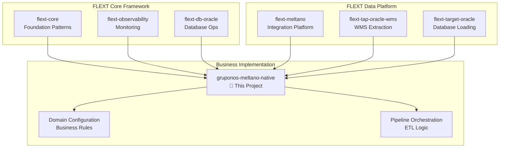
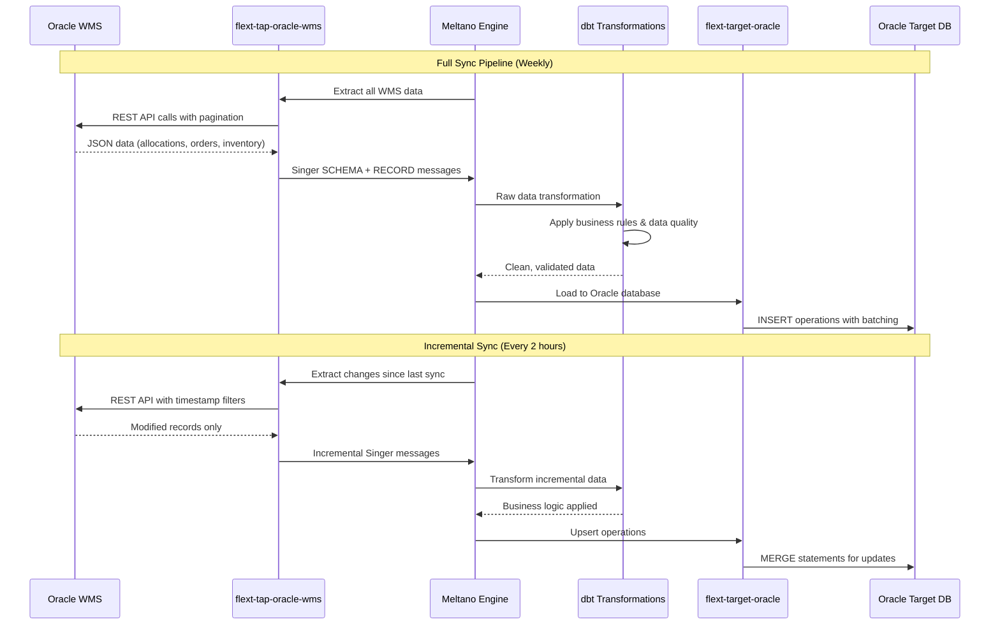

# GrupoNOS Meltano Native - Enterprise ETL Pipeline

[](https://www.python.org/downloads/)
[](https://github.com/flext-sh/flext)
[](https://meltano.com)
[](https://www.oracle.com/applications/supply-chain-management/warehouse-management/)
[](https://blog.cleancoder.com/uncle-bob/2012/08/13/the-clean-architecture.html)
[](https://pytest.org)

**Enterprise-grade Oracle WMS ETL pipeline built on the FLEXT framework ecosystem, implementing Clean Architecture and Domain-Driven Design patterns for scalable, maintainable data integration.**

---

## 🎯 Project Objective

GrupoNOS Meltano Native serves as a **specialized FLEXT ecosystem implementation** that demonstrates enterprise-grade ETL patterns for Oracle Warehouse Management System (WMS) integration. This project showcases:

- **FLEXT Framework Integration**: Real-world implementation of flext-core patterns
- **Clean Architecture**: Proper layer separation with domain-driven design
- **Enterprise ETL Patterns**: Production-ready data pipeline architecture
- **Oracle WMS Specialization**: Domain-specific business logic for warehouse operations

### Role in FLEXT Ecosystem



---

## 🚀 Quick Start

### Prerequisites

- **Python 3.13+** with async support
- **Poetry** for dependency management
- **Oracle WMS** API access credentials
- **Oracle Database** target connection
- **FLEXT Framework Dependencies** (managed via local paths)

### Installation

```bash
# Clone the repository
git clone <repository-url>
cd gruponos-meltano-native

# Install dependencies
poetry install --with dev,test

# Setup development environment
make setup

# Configure environment variables
cp .env.example .env
# Edit .env with your Oracle WMS and database credentials
```

### First Pipeline Execution

```bash
# Install Meltano plugins
make meltano-install

# Validate all configurations
make validate

# Test Oracle connections
make oracle-test

# Execute full ETL pipeline
make meltano-run
```

---

## 🏗️ Architecture Overview

### FLEXT Framework Foundation

This project is built on **flext-core** patterns and extends the FLEXT ecosystem:

```python
from flext_core import FlextResult, FlextBaseSettings, get_logger
from gruponos_meltano_native import GruponosMeltanoOrchestrator

# All operations return FlextResult for consistent error handling
async def execute_etl_pipeline() -> FlextResult[PipelineResult]:
    orchestrator = GruponosMeltanoOrchestrator()
    
    result = await orchestrator.execute_full_sync(
        company_code="GNOS",
        facility_code="DC01"
    )
    
    if result.success():
        logger.info(f"Pipeline completed: {result.value.records_processed} records")
    else:
        logger.error(f"Pipeline failed: {result.error}")
    
    return result
```

### Clean Architecture Implementation

```
src/gruponos_meltano_native/
├── 🎯 Domain Layer
│   ├── config.py                 # Domain configuration with Pydantic
│   ├── exceptions.py             # Domain-specific exceptions
│   └── validators/               # Business rule validation
│       └── data_validator.py
├── 🔄 Use Cases Layer  
│   ├── orchestrator.py           # Pipeline orchestration logic
│   └── cli.py                    # Command-line use cases
├── 🔌 Interface Adapters Layer
│   ├── oracle/                   # Oracle WMS API integration
│   │   └── connection_manager_enhanced.py
│   └── monitoring/               # Observability adapters
│       └── alert_manager.py
└── 🏗️ Infrastructure Layer
    └── infrastructure/
        └── di_container.py       # Dependency injection
```

### Data Pipeline Architecture



---

## 🛠️ Development Commands

### Essential Quality Gates

```bash
# Complete validation pipeline (zero tolerance)
make validate                    # lint + type + security + test + oracle-test

# Quick development checks
make check                       # lint + type + security + oracle-test
make test                        # Run tests with 90% coverage requirement
make format                      # Auto-format code with Ruff
```

### FLEXT-Standard Operations

```bash
# Setup and installation
make setup                       # Complete development environment setup
make install-dev                 # Install all dependencies including dev tools

# Code quality (following FLEXT standards)
make lint                        # Ruff linting with ALL rules enabled
make type-check                  # MyPy strict mode type checking
make security                    # Bandit + pip-audit security scanning
make fix                         # Auto-fix linting issues

# Testing (comprehensive coverage)
make test-unit                   # Fast unit tests with mocks
make test-integration            # Integration tests with real Oracle connections
make coverage-html               # Generate HTML coverage reports
```

### Meltano Pipeline Operations

```bash
# Core Meltano workflow
make meltano-install             # Install all Meltano plugins
make meltano-validate            # Validate Meltano configuration
make meltano-test                # Test all plugin connections
make meltano-run                 # Execute full pipeline
make meltano-discover            # Discover schemas from Oracle WMS
make meltano-elt                 # Run extract-load-transform process

# Environment and connection testing
make oracle-test                 # Test Oracle WMS API connectivity
make env-validate                # Validate environment configuration
make validate-schemas            # Validate database schemas
```

### Diagnostic and Maintenance

```bash
# System diagnostics
make diagnose                    # Show versions and environment info
make doctor                      # Complete health check

# Dependency management
make deps-update                 # Update all dependencies
make deps-audit                  # Security audit of dependencies
make clean                       # Clean build artifacts
```

---

## ⚙️ Configuration Management

### Environment Variables

```bash
# Oracle WMS Source Configuration
export TAP_ORACLE_WMS_BASE_URL="https://wms.gruponos.com/api/v1"
export TAP_ORACLE_WMS_USERNAME="gruponos_etl_user"
export TAP_ORACLE_WMS_PASSWORD="secure_password"
export TAP_ORACLE_WMS_COMPANY_CODE="GNOS"
export TAP_ORACLE_WMS_FACILITY_CODE="DC01"

# Oracle Target Database Configuration
export FLEXT_TARGET_ORACLE_HOST="oracle-dw.gruponos.com"
export FLEXT_TARGET_ORACLE_PORT="1521"
export FLEXT_TARGET_ORACLE_SERVICE_NAME="GNOSDW"
export FLEXT_TARGET_ORACLE_USERNAME="gruponos_etl"
export FLEXT_TARGET_ORACLE_PASSWORD="secure_password"
export FLEXT_TARGET_ORACLE_PROTOCOL="tcps"
export FLEXT_TARGET_ORACLE_SCHEMA="WMS_STAGE"

# FLEXT Framework Configuration
export FLEXT_ENVIRONMENT="production"
export FLEXT_LOG_LEVEL="INFO"
export FLEXT_ENABLE_METRICS="true"
export FLEXT_ENABLE_TRACING="true"
```

### Meltano Pipeline Configuration

```yaml
# meltano.yml - Dual pipeline architecture
plugins:
  extractors:
    - name: tap-oracle-wms-full
      executable: flext-tap-oracle-wms        # FLEXT-provided tap
      config:
        base_url: $TAP_ORACLE_WMS_BASE_URL
        entities: ["allocation", "order_hdr", "order_dtl"]
        enable_incremental: false
        page_size: 500

    - name: tap-oracle-wms-incremental  
      executable: flext-tap-oracle-wms
      config:
        base_url: $TAP_ORACLE_WMS_BASE_URL
        enable_incremental: true
        replication_key: "mod_ts"

  loaders:
    - name: target-oracle-full
      executable: flext-target-oracle         # FLEXT-provided target
      config:
        oracle_config:
          host: $FLEXT_TARGET_ORACLE_HOST
          service_name: $FLEXT_TARGET_ORACLE_SERVICE_NAME
        load_method: "append_only"

    - name: target-oracle-incremental
      executable: flext-target-oracle
      config:
        oracle_config:
          host: $FLEXT_TARGET_ORACLE_HOST
        load_method: "upsert"

jobs:
  - name: full-sync-job
    tasks: [tap-oracle-wms-full target-oracle-full]
    
  - name: incremental-sync-job  
    tasks: [tap-oracle-wms-incremental target-oracle-incremental]

schedules:
  - name: full-sync-weekly
    job: full-sync-job
    interval: "@weekly"
    
  - name: incremental-sync-every-2-hours
    job: incremental-sync-job
    interval: "0 */2 * * *"
```

---

## 🧪 Testing Strategy

### Test Architecture

```bash
# Test execution patterns
pytest -m unit                  # Fast unit tests (< 1s each)
pytest -m integration           # Integration tests with Oracle WMS/DB
pytest -m wms                   # WMS-specific business logic tests
pytest -m oracle                # Oracle database integration tests
pytest -m performance           # Performance and load testing
pytest -m "not slow"            # Exclude slow tests for rapid feedback

# Specific test execution
pytest tests/unit/test_orchestrator.py::test_full_sync_success -v
pytest tests/integration/test_end_to_end_oracle_integration.py -xvs
```

### Coverage Requirements

- **Minimum 90% Coverage**: Enforced via `--cov-fail-under=90`
- **Unit Tests**: Comprehensive mocking for fast execution
- **Integration Tests**: Real Oracle WMS and database connections
- **End-to-End Tests**: Complete pipeline validation

### Test Structure

```
tests/
├── unit/                      # Fast unit tests (344 tests)
│   ├── test_orchestrator.py   # Pipeline orchestration logic
│   ├── test_config.py         # Configuration validation
│   ├── test_validators.py     # Data validation business rules
│   └── test_cli.py            # Command-line interface
├── integration/               # Integration tests with external systems
│   ├── test_end_to_end_oracle_integration.py
│   └── test_performance_and_load.py
└── fixtures/                  # Test data and configurations
    ├── sample_wms_data.json
    └── test_oracle_schemas.sql
```

---

## 📊 Data Models & Business Logic

### Core Business Entities

```python
from pydantic import BaseModel
from datetime import datetime
from typing import Optional

class WMSAllocation(BaseModel):
    """Oracle WMS allocation business entity"""
    allocation_id: str
    company_code: str
    facility_code: str
    order_dtl_id: str
    item_code: str
    location: str
    allocated_quantity: int
    packed_quantity: Optional[int] = None
    allocation_status: str
    created_timestamp: datetime
    modified_timestamp: datetime

class OrderHeader(BaseModel):
    """Order header with customer information"""
    order_id: str
    company_code: str
    facility_code: str
    customer_id: str
    order_status: str
    order_date: datetime
    
class OrderDetail(BaseModel):
    """Order line items and product details"""
    order_dtl_id: str
    order_id: str
    item_code: str
    ordered_quantity: int
    unit_price: float
```

### dbt Transformations

```sql
-- models/staging/stg_wms_allocation.sql
-- Raw data standardization following FLEXT patterns
{{ config(materialized='view') }}

SELECT
    allocation_id,
    company_code,
    facility_code,  
    order_dtl_id,
    item_code,
    location,
    allocated_quantity,
    packed_quantity,
    allocation_status,
    created_timestamp,
    modified_timestamp,
    {{ generate_surrogate_key(['allocation_id', 'company_code']) }} as allocation_key
FROM {{ source('wms_raw', 'allocation') }}
WHERE allocation_id IS NOT NULL
  AND company_code = 'GNOS'

-- models/marts/warehouse/fact_allocation_performance.sql  
-- Business analytics following DDD patterns
{{ config(
    materialized='table',
    indexes=[
        {'columns': ['facility_code', 'business_date']},
        {'columns': ['allocation_key']}
    ]
) }}

WITH allocation_metrics AS (
    SELECT
        facility_code,
        DATE(created_timestamp) as business_date,
        COUNT(*) as total_allocations,
        SUM(allocated_quantity) as total_allocated_qty,
        SUM(packed_quantity) as total_packed_qty,
        AVG(
            EXTRACT(EPOCH FROM (modified_timestamp - created_timestamp))
        ) as avg_processing_time_seconds
    FROM {{ ref('stg_wms_allocation') }}
    WHERE allocation_status = 'COMPLETED'
    GROUP BY facility_code, DATE(created_timestamp)
)

SELECT
    facility_code,
    business_date,
    total_allocations,
    total_allocated_qty,
    total_packed_qty,
    ROUND(
        (total_packed_qty::DECIMAL / NULLIF(total_allocated_qty, 0)) * 100, 
        2
    ) as fulfillment_rate_pct,
    avg_processing_time_seconds,
    CURRENT_TIMESTAMP as dbt_updated_at
FROM allocation_metrics
```

---

## 🔍 Monitoring & Observability

### FLEXT Observability Integration

```python
from flext_observability import get_metrics_client, get_tracer, create_health_check

class GruponosMeltanoMonitoring:
    def __init__(self):
        self.metrics = get_metrics_client()
        self.tracer = get_tracer("gruponos-meltano-native")
    
    async def track_pipeline_execution(self, pipeline_name: str):
        """Track pipeline metrics with distributed tracing"""
        with self.tracer.start_span("pipeline_execution") as span:
            span.set_attribute("pipeline.name", pipeline_name)
            span.set_attribute("company.code", "GNOS")
            
            # Business metrics
            self.metrics.counter("pipeline.executions.total").inc()
            self.metrics.histogram("pipeline.duration.seconds").observe(duration)
            self.metrics.gauge("pipeline.records.processed").set(record_count)
    
    def create_health_checks(self):
        """Enterprise health checks"""
        return [
            create_health_check("oracle_wms_api", self._check_wms_connection),
            create_health_check("oracle_database", self._check_db_connection),
            create_health_check("meltano_pipeline", self._check_pipeline_health)
        ]
```

### Key Performance Indicators

- **Pipeline Success Rate**: Percentage of successful pipeline executions
- **Data Processing Volume**: Records extracted/transformed/loaded per execution
- **Processing Time**: End-to-end pipeline execution duration
- **Data Quality Score**: Percentage of records passing validation rules
- **Oracle WMS API Response Time**: Average API response latency
- **Database Performance**: Query execution times and connection health

---

## 🚀 CLI Usage

### Command-Line Interface

```bash
# Primary CLI operations
poetry run python -m gruponos_meltano_native.cli --help

# Development mode with enhanced logging
poetry run python -m gruponos_meltano_native.cli --dev

# Execute specific pipeline jobs
poetry run python -m gruponos_meltano_native.cli run \
    --job full-sync-job \
    --environment production

# Validate configuration and connections
poetry run python -m gruponos_meltano_native.cli validate \
    --include-oracle-health \
    --include-meltano-test

# System diagnostics
poetry run python -m gruponos_meltano_native.cli diagnose \
    --include-dependencies \
    --include-performance-metrics
```

### Programmatic Usage

```python
from gruponos_meltano_native import (
    GruponosMeltanoOrchestrator,
    GruponosMeltanoSettings,
    create_gruponos_meltano_platform
)

# Create configured platform instance
platform = create_gruponos_meltano_platform()

# Execute full synchronization with monitoring
result = await platform.execute_full_sync(
    company_code="GNOS",
    facility_code="DC01",
    enable_monitoring=True,
    dry_run=False
)

if result.success():
    print(f"✅ Sync completed: {result.value.summary}")
    print(f"📊 Records processed: {result.value.records_processed}")
    print(f"⏱️ Duration: {result.value.duration_seconds}s")
else:
    print(f"❌ Sync failed: {result.error}")
```

---

## 📦 Dependencies & FLEXT Integration

### FLEXT Ecosystem Dependencies

```toml
# pyproject.toml - FLEXT framework dependencies
[tool.poetry.dependencies]
python = ">=3.13,<3.14"

# FLEXT Core Framework (local development paths)
flext-core = {path = "../flext-core", develop = true}
flext-observability = {path = "../flext-observability", develop = true}
flext-db-oracle = {path = "../flext-db-oracle", develop = true}

# FLEXT Data Integration Platform  
flext-tap-oracle-wms = {path = "../flext-tap-oracle-wms", develop = true}
flext-target-oracle = {path = "../flext-target-oracle", develop = true}

# Business Logic Dependencies
pydantic = ">=2.11.7"
click = ">=8.2.1"
meltano = ">=3.8.0"
structlog = ">=25.4.0"
```

### External Dependencies

```toml
# External ecosystem integration
[tool.poetry.dependencies]
meltano = ">=3.8.0"              # Data integration orchestration
pydantic = ">=2.11.7"            # Data validation and settings
click = ">=8.2.1"                # CLI framework
pyyaml = ">=6.0.2"               # Configuration management
requests = ">=2.32.4"            # HTTP client for Oracle WMS API
```

---

## 🛠️ Troubleshooting

### Common Issues & Solutions

#### Connection Problems

```bash
# Test Oracle WMS API connectivity
make oracle-test

# Validate Meltano configuration
make meltano-validate

# Check all environment variables
make env-validate
```

#### Pipeline Failures

```bash
# Diagnose pipeline health
make diagnose

# View detailed pipeline logs
meltano run tap-oracle-wms-full target-oracle-full --log-level debug

# Test individual pipeline components
meltano invoke tap-oracle-wms-full --discover
meltano test tap-oracle-wms-full
```

#### Quality Gate Failures

```bash
# Fix code formatting automatically
make fix

# Check type errors with detailed output
poetry run mypy src/ --show-error-codes

# Review security vulnerabilities
poetry run bandit -r src/ --format json
```

#### Performance Issues

```bash
# Run performance benchmarks
pytest -m performance --benchmark-only

# Monitor resource usage during execution
make meltano-run & top -p $!

# Check database query performance
-- Monitor Oracle execution plans
EXPLAIN PLAN FOR SELECT * FROM wms_stage.allocation;
```

---

## 📚 Documentation

### Complete Documentation Set

- **[📖 Documentation Hub](docs/README.md)** - Complete documentation navigation
- **[🏗️ Architecture](docs/architecture/README.md)** - System architecture and design patterns
- **[🔌 FLEXT Integration](docs/architecture/flext-integration.md)** - FLEXT framework integration details
- **[🧩 API Reference](docs/api/README.md)** - Complete API documentation
- **[🚀 Deployment Guide](docs/deployment/README.md)** - Production deployment strategies
- **[🎯 Business Logic](docs/business/oracle-wms.md)** - Oracle WMS integration and data models

### Development References

- **[CLAUDE.md](CLAUDE.md)** - Development guidance for AI assistants
- **[TODO.md](docs/TODO.md)** - Technical debt and improvement roadmap
- **[config/README.md](config/README.md)** - Configuration management guide

### FLEXT Ecosystem Integration

This project demonstrates real-world usage of FLEXT framework components:

- **[flext-core](../flext-core/)** - Foundation patterns and dependency injection
- **[flext-observability](../flext-observability/)** - Enterprise monitoring and metrics
- **[flext-db-oracle](../flext-db-oracle/)** - Oracle database connectivity
- **[flext-tap-oracle-wms](../flext-tap-oracle-wms/)** - Oracle WMS data extraction
- **[flext-target-oracle](../flext-target-oracle/)** - Oracle database loading

---

## 🤝 Contributing

### Development Workflow

1. **Fork & Clone**: Fork repository and clone locally
2. **Environment Setup**: Run `make setup` for complete development environment
3. **Feature Development**: Create feature branch following naming convention
4. **Quality Gates**: Run `make validate` before committing (zero tolerance)
5. **Testing**: Ensure 90% test coverage and all integration tests pass
6. **Documentation**: Update relevant documentation for changes
7. **Pull Request**: Submit PR with comprehensive description

### Code Standards

- **Python 3.13+**: Modern async/await patterns with strict typing
- **FLEXT Patterns**: Follow flext-core patterns consistently
- **Clean Architecture**: Maintain strict layer separation
- **Domain-Driven Design**: Rich domain entities with business logic
- **Test Coverage**: Minimum 90% with comprehensive integration tests

---

## 📄 License

MIT License - see [LICENSE](LICENSE) for details.

---

## 🔗 Related Projects

### FLEXT Ecosystem

- **[FLEXT Framework](https://github.com/flext-sh/flext)** - Main framework repository
- **[flext-core](../flext-core/)** - Foundation library with shared patterns
- **[flext-observability](../flext-observability/)** - Enterprise monitoring and logging
- **[flext-meltano](../flext-meltano/)** - Meltano integration platform

### Data Integration Components

- **[flext-tap-oracle-wms](../flext-tap-oracle-wms/)** - Oracle WMS data extraction
- **[flext-target-oracle](../flext-target-oracle/)** - Oracle database loading
- **[flext-db-oracle](../flext-db-oracle/)** - Oracle database connectivity

---

**Framework**: FLEXT Ecosystem v0.9.0 | **Architecture**: Clean Architecture + DDD | **Updated**: 2025-08-04
