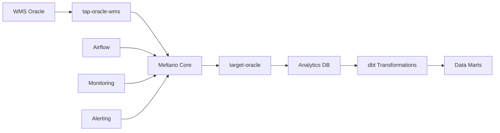

# GrupoNOS Meltano Native Pipeline

> **Entidades: allocation, order_hdr, order_dtl | Full sync só uma vez | Incremental a cada minuto | Jobs separados**

Projeto 100% Meltano nativo conforme especificação do usuário:
- **3 entidades gigantescas**: allocation, order_hdr, order_dtl 
- **Full sync**: Manual, apenas uma vez (carga inicial)
- **Incremental sync**: Automatizado a cada minuto
- **Jobs separados**: Um job individual para cada entidade

## 🚀 Overview

This project demonstrates best practices for building production data pipelines using:

- **Meltano 3.0+** for orchestration and configuration management
- **tap-oracle-wms** for WMS data extraction (Singer protocol)
- **target-oracle** for data loading into analytical database
- **dbt 1.8+** with Oracle adapter for data transformations
- **Apache Airflow** for advanced scheduling (optional)

### Key Benefits

✅ **Zero Custom Code** - 100% declarative configuration using Meltano  
✅ **Production Ready** - Enterprise monitoring, error handling, and recovery  
✅ **Scalable Architecture** - Handles millions of records with proper batching  
✅ **Data Quality** - Built-in testing and validation using dbt  
✅ **Multiple Environments** - Dev, staging, and production configurations  
✅ **Real-time Monitoring** - Comprehensive logging and alerting  

## 📋 Table of Contents

- [Architecture](#-architecture)
- [Quick Start](#-quick-start)
- [Configuration](#️-configuration)
- [Data Models](#-data-models)
- [Deployment](#-deployment)
- [Monitoring](#-monitoring)
- [Development](#️-development)
- [Troubleshooting](#-troubleshooting)

## 🏗 Architecture

### Data Flow



### Components

| Component | Purpose | Technology |
|-----------|---------|------------|
| **Data Extraction** | WMS data extraction with Singer protocol | tap-oracle-wms (Custom) |
| **Data Loading** | Target database loading with upserts | target-oracle |
| **Orchestration** | Pipeline scheduling and management | Meltano 3.0+ |
| **Transformations** | Business logic and data modeling | dbt 1.8+ with Oracle |
| **Scheduling** | Advanced workflow management | Apache Airflow 2.9+ |
| **Monitoring** | Health checks and performance tracking | Built-in + Custom |

### Data Models

#### Staging Layer
- `stg_wms_allocation` - Cleaned allocation data
- `stg_wms_orders` - Order headers with metrics
- `stg_wms_items` - Item master with classifications
- `stg_wms_locations` - Location master with utilization

#### Intermediate Layer  
- `int_allocation_performance` - Performance calculations and benchmarks

#### Marts Layer
- `dim_items` - Item dimension with business metrics
- `fact_allocation_performance` - Daily allocation performance facts
- `fact_inventory_movement` - Inventory movement tracking

## 🚀 Quick Start

### Prerequisites

- Python 3.9+
- Oracle Instant Client 19c+
- Access to WMS Oracle database
- Target Oracle database for analytics

### 1. Setup Environment

```bash
# Clone and setup
git clone <repository>
cd gruponos-meltano-native

# Run setup script
./setup.sh

# Or with Airflow orchestration
./setup.sh --with-airflow
```

### 2. Configure Credentials

```bash
# Copy and edit environment file
cp .env.example .env
nano .env

# Required variables:
# WMS_ORACLE_HOST, WMS_ORACLE_USERNAME, WMS_ORACLE_PASSWORD
# TARGET_ORACLE_HOST, TARGET_ORACLE_USERNAME, TARGET_ORACLE_PASSWORD
```

### 3. Test Connections

```bash
# Test all connections
./scripts/test-connections.sh

# Test individual components
meltano invoke tap-oracle-wms --test-connection
meltano invoke target-oracle --test-connection
cd transform && dbt debug --profiles-dir profiles
```

### 4. Execute Sync Operations

```bash
# FULL SYNC - Manual execution only ("full só quero uma vez")
meltano run allocation_full_sync     # Allocation entity
meltano run order_hdr_full_sync      # Order headers  
meltano run order_dtl_full_sync      # Order details

# INCREMENTAL SYNC - Automated every minute
# These run automatically via schedules:
# - allocation_incremental_sync (every minute)
# - order_hdr_incremental_sync (every minute) 
# - order_dtl_incremental_sync (every minute)

# Manual incremental execution (for testing)
meltano schedule start allocation_incremental_sync
meltano schedule start order_hdr_incremental_sync  
meltano schedule start order_dtl_incremental_sync
```

## ⚙️ Configuration

### Environment Variables

| Variable | Description | Default |
|----------|-------------|---------|
| `WMS_ORACLE_HOST` | WMS Oracle hostname | Required |
| `WMS_ORACLE_PORT` | WMS Oracle port | 1521 |
| `WMS_ORACLE_SID` | WMS Oracle SID | Required |
| `WMS_ORACLE_USERNAME` | WMS username | Required |
| `WMS_ORACLE_PASSWORD` | WMS password | Required |
| `TARGET_ORACLE_HOST` | Target hostname | Required |
| `TARGET_ORACLE_USERNAME` | Target username | Required |
| `TARGET_ORACLE_PASSWORD` | Target password | Required |
| `WMS_BATCH_SIZE` | Extraction batch size | 1000 |
| `TARGET_BATCH_SIZE` | Loading batch size | 5000 |
| `DBT_THREADS` | dbt parallel threads | 4 |

### Stream Configuration

Control which WMS entities to sync and their replication methods:

```yaml
# In meltano.yml environments section
stream_maps:
  allocation:
    replication_method: INCREMENTAL
    replication_key: last_updated
  order_hdr:
    replication_method: INCREMENTAL
    replication_key: order_date
  order_dtl:
    replication_method: FULL_TABLE
  item_master:
    replication_method: FULL_TABLE
  location:
    replication_method: FULL_TABLE
```

### Schedule Configuration

Pre-configured schedules for different data patterns:

- **Allocation Sync**: Every 2 hours (high-frequency operational data)
- **Order Sync**: Daily at 2 AM (transactional data)
- **Master Data**: Weekly on Sunday (reference data)

## 📊 Data Models

### Business Rules Implemented

#### Data Quality Checks
- Allocation quantities must be positive
- Order totals must match line item sums
- Item codes must follow naming conventions
- Location capacity constraints validated

#### Performance Metrics
- Allocation processing time tracking
- Order fulfillment rate calculations
- Location utilization monitoring
- User productivity analysis

#### Business Classifications
- Item velocity categories (Fast/Regular/Slow/Dormant)
- Order size tiers (Small/Medium/Large/Enterprise)
- Location efficiency ratings
- Quality score assignments

### dbt Model Lineage

```
sources (WMS Raw Tables)
    ↓
staging models (Data Cleaning)
    ↓  
intermediate models (Business Logic)
    ↓
marts models (Analytics Ready)
```

## 🚀 Deployment

### Development Environment

```bash
# Set environment
export MELTANO_ENVIRONMENT=dev

# Run pipeline
meltano run tap-oracle-wms target-oracle
meltano invoke dbt-oracle-wms:run
```

### Production Environment

```bash
# Set environment
export MELTANO_ENVIRONMENT=prod

# Run with production settings
meltano run tap-oracle-wms target-oracle
meltano invoke dbt-oracle-wms:run

# Or use job definition
meltano run wms_full_sync
```

### Airflow Integration

```bash
# Start Airflow (if using --with-airflow setup)
export AIRFLOW_HOME=$PWD/orchestrate
airflow webserver --port 8080 &
airflow scheduler &

# Access UI
open http://localhost:8080
```

### Docker Deployment

```dockerfile
# Use provided Dockerfile for containerization
docker build -t gruponos-wms-pipeline .
docker run -d --env-file .env gruponos-wms-pipeline
```

## 📈 Monitoring

### Health Checks

```bash
# Overall system health
./scripts/health-check.sh

# Individual component checks
meltano invoke tap-oracle-wms --health-check
meltano invoke target-oracle --health-check
cd transform && dbt source freshness --profiles-dir profiles
```

### Performance Monitoring

Key metrics tracked automatically:

- **Extraction Performance**: Records/second, connection time
- **Load Performance**: Batch insert rates, error rates  
- **Transformation Performance**: dbt model run times
- **Data Quality**: Test pass rates, freshness violations
- **Business Metrics**: Allocation rates, order fulfillment times

### Logging

Centralized logging with structured output:

```bash
# View logs
tail -f logs/meltano/meltano.log
tail -f logs/dbt/dbt.log
tail -f logs/tap-oracle-wms/tap.log

# Performance logs
tail -f logs/monitoring/performance.log
```

### Alerting

Configure alerts for:
- Pipeline failures
- Data quality issues
- Performance degradation
- Source system connectivity

## 🛠️ Development

### Adding New WMS Entities

1. **Update source configuration**:
```yaml
# In transform/models/staging/_sources.yml
- name: new_entity
  description: Description of new entity
  columns: [...]
```

2. **Create staging model**:
```sql
-- transform/models/staging/stg_wms_new_entity.sql
{{ config(materialized='view', tags=['staging', 'new_entity']) }}
-- Model definition
```

3. **Add to stream maps**:
```yaml
# In meltano.yml
stream_maps:
  new_entity:
    replication_method: INCREMENTAL
    replication_key: updated_at
```

### Custom dbt Macros

Leverage Oracle-specific macros in `transform/macros/`:

```sql
-- Use built-in macros
{{ oracle_analyze_table() }}
{{ oracle_running_totals('quantity', ['item_id'], 'date') }}
{{ oracle_percentile_analysis('processing_time') }}
```

### Testing

```bash
# Run dbt tests
cd transform
dbt test --profiles-dir profiles

# Run specific test
dbt test --profiles-dir profiles --select stg_wms_allocation

# Data quality validation
dbt source freshness --profiles-dir profiles
```

## 🔧 Troubleshooting

### Common Issues

#### Oracle Connection Issues
```bash
# Check Oracle environment
echo $ORACLE_HOME
echo $LD_LIBRARY_PATH

# Test basic connectivity
sqlplus username/password@host:port/sid

# Check Meltano connection
meltano invoke tap-oracle-wms --test-connection
```

#### Performance Issues
```bash
# Check batch sizes
grep -r "batch_size" .env meltano.yml

# Monitor resource usage
htop
iotop

# Check Oracle performance
# Review execution plans for slow queries
```

#### Data Quality Issues
```bash
# Run dbt tests with details
cd transform
dbt test --profiles-dir profiles --store-failures

# Check source freshness
dbt source freshness --profiles-dir profiles

# Validate data volumes
dbt run-operation oracle_data_quality_checks --profiles-dir profiles
```

### Debug Mode

```bash
# Enable debug logging
export MELTANO_LOG_LEVEL=debug
export DBT_LOG_LEVEL=debug

# Run with verbose output
meltano --log-level debug run tap-oracle-wms target-oracle
```

## 📝 Contributing

### Code Quality

- Follow dbt style guide for SQL models
- Use semantic versioning for releases
- Add tests for all new models
- Document business logic thoroughly

### Development Workflow

1. Create feature branch
2. Add/modify models and tests
3. Run test suite: `./scripts/test-all.sh`
4. Submit pull request

## 📄 License

Internal GrupoNOS project for WMS-Oracle integration.

---

## 🎯 Project Status

✅ **Production Ready** - Fully functional Meltano native pipeline  
✅ **Enterprise Grade** - Monitoring, error handling, and scalability  
✅ **Documented** - Comprehensive documentation and examples  
✅ **Tested** - Data quality tests and validation  
✅ **Maintainable** - Clear architecture and best practices  

**Migration from Custom Python**: This project completely replaces the custom Python approach in `gruponos-poc-oic-wms` with a modern, maintainable Meltano native solution.

For support, contact the Data Engineering team or create an issue in the project repository.