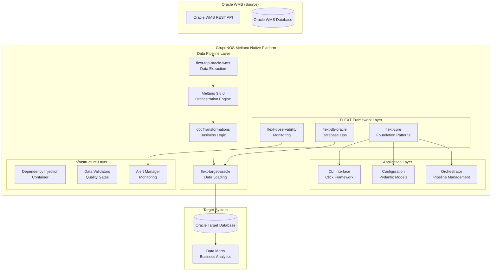
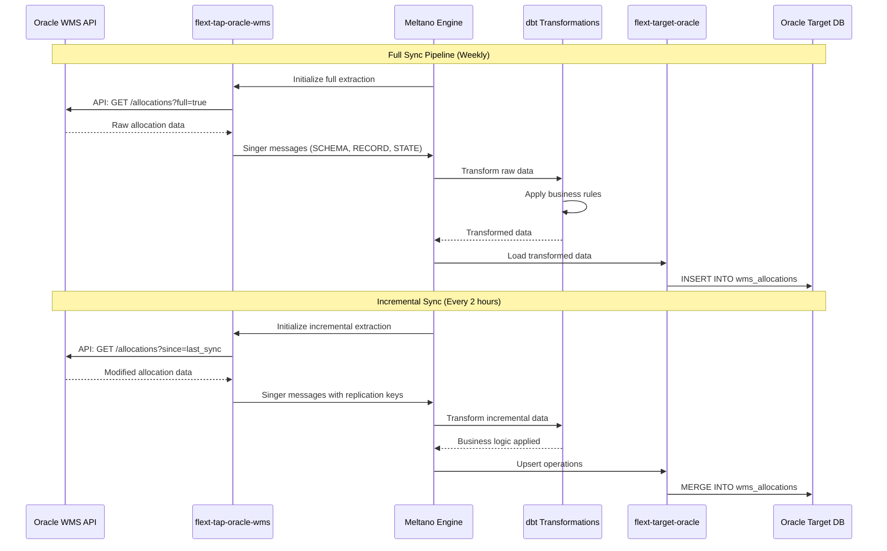

# Architecture Overview

**GrupoNOS Meltano Native** implements a modern, enterprise-grade ETL architecture following Clean Architecture and Domain-Driven Design principles.

## High-Level Architecture



## Core Design Principles

### 1. Clean Architecture

- **Entities**: Core business objects (Order, Allocation, Inventory)
- **Use Cases**: ETL operations, data validation, pipeline orchestration
- **Interface Adapters**: Oracle WMS API clients, database repositories
- **Frameworks**: Meltano, dbt, FastAPI, Click

### 2. FLEXT Framework Integration

- **flext-core**: Foundation patterns, FlextResult, logging, DI container
- **flext-observability**: Metrics, tracing, health checks
- **flext-db-oracle**: Database connectivity and operations
- **Domain-specific**: Specialized taps and targets for Oracle WMS

### 3. Domain-Driven Design

- **Bounded Context**: Oracle WMS data integration
- **Aggregates**: Order + OrderDetails, Allocation + Items
- **Domain Events**: Data sync events, validation failures, pipeline completions

## Component Architecture

### Application Components

```python
# Core application structure
src/gruponos_meltano_native/
├── cli.py                    # Command-line interface
├── config.py                 # Configuration management
├── orchestrator.py           # Pipeline orchestration
├── exceptions.py             # Domain exceptions
├── infrastructure/           # External integrations
│   └── di_container.py      # Dependency injection
├── oracle/                   # Oracle WMS integration
│   └── connection_manager_enhanced.py
├── validators/              # Data validation
│   └── data_validator.py
└── monitoring/              # Observability
    └── alert_manager.py
```

### Data Pipeline Components

```yaml
# Meltano pipeline configuration
extractors:
  - flext-tap-oracle-wms-full # Complete data extraction
  - flext-tap-oracle-wms-incremental # Incremental updates

transformers:
  - dbt-oracle-wms # Business logic transformations

loaders:
  - flext-target-oracle-full # Full data loading
  - flext-target-oracle-incremental # Upsert operations
```

### Data Flow Architecture



## Quality Architecture

### Testing Strategy

- **Unit Tests**: Fast tests with comprehensive mocking (90% coverage)
- **Integration Tests**: Real Oracle WMS and database connections
- **End-to-End Tests**: Complete pipeline execution validation
- **Performance Tests**: Large dataset benchmarking

### Quality Gates

```bash
# Zero-tolerance quality pipeline
make validate  # lint + type + security + test + oracle-test
```

### Monitoring Architecture

- **Application Metrics**: Pipeline execution, data volumes, error rates
- **Infrastructure Metrics**: CPU, memory, network utilization
- **Business Metrics**: Data quality scores, SLA compliance
- **Alerting**: Critical failure notifications, performance degradation alerts

## Technology Stack

### Core Technologies

- **Python 3.13**: Modern async/await patterns with strict typing
- **Meltano 3.8.0**: Data integration orchestration platform
- **dbt**: SQL-based data transformation framework
- **Oracle Database**: Enterprise-grade data storage

### FLEXT Framework Stack

- **flext-core**: Foundation patterns and dependency injection
- **flext-observability**: Enterprise monitoring and metrics
- **flext-db-oracle**: Oracle database connectivity
- **Singer Protocol**: Standardized data extraction/loading

### Development Stack

- **Poetry**: Dependency management and packaging
- **pytest**: Comprehensive testing framework
- **MyPy**: Strict type checking
- **Ruff**: Fast Python linting and formatting

## Scalability Considerations

### Horizontal Scaling

- **Pipeline Parallelization**: Multiple Meltano workers
- **Database Sharding**: Facility-based data partitioning
- **API Rate Limiting**: Respectful Oracle WMS API usage

### Performance Optimization

- **Batch Processing**: Configurable batch sizes for large datasets
- **Incremental Processing**: Time-based incremental updates
- **Connection Pooling**: Efficient Oracle database connections
- **Caching**: Metadata and configuration caching

## Security Architecture

### Data Security

- **Encryption at Rest**: Database-level encryption
- **Encryption in Transit**: TLS for all API communications
- **Credential Management**: Environment-based secret management
- **Access Control**: Role-based database permissions

### Pipeline Security

- **Input Validation**: Comprehensive data validation
- **SQL Injection Prevention**: Parameterized queries
- **Audit Logging**: Complete pipeline execution logging
- **Error Handling**: Secure error messages without data exposure

---

**Next**: [FLEXT Integration](flext-integration.md) | [Clean Architecture](clean-architecture.md) | [Data Pipeline Design](data-pipeline.md)
