# Arc42 Architecture Documentation

**Project**: gruponos-meltano-native | **Version**: 0.9.0 | **Framework**: Arc42 Template
**Last Updated**: 2025-10-10 | **Status**: Production-Ready ETL Pipeline

---

## 📋 Arc42 Overview

This document follows the [Arc42](https://arc42.org/) template for comprehensive software architecture documentation. Arc42 provides a standardized structure for documenting software systems with 12 main sections covering all aspects of system architecture.

### Documentation Structure

```
1. Introduction & Goals
2. Constraints
3. Context & Scope
4. Solution Strategy
5. Building Block View
6. Runtime View
7. Deployment View
8. Concepts (Cross-cutting)
9. Architecture Decisions
10. Quality Requirements
11. Risks & Technical Debt
12. Glossary
```

---

## 1. Introduction & Goals

### 1.1 Business Context

**GrupoNOS Meltano Native** is an enterprise-grade ETL (Extract, Transform, Load) pipeline implementation specifically designed for integrating Oracle Warehouse Management System (WMS) data with downstream analytics databases. The system serves Grupo Nos, a Portuguese energy company, by providing reliable, scalable data integration capabilities for their warehouse operations.

### 1.2 Business Goals

#### Primary Business Goals
- **Data Availability**: Ensure WMS operational data is available for analytics within 2 hours of creation
- **Data Quality**: Maintain 99.9% data accuracy and completeness in analytics systems
- **Operational Efficiency**: Reduce manual data integration efforts by 80%
- **Business Intelligence**: Enable real-time warehouse performance analytics and reporting

#### Secondary Business Goals
- **Scalability**: Support warehouse operations growth from current 50K to 500K+ daily transactions
- **Reliability**: Achieve 99.5% pipeline uptime with automated error recovery
- **Cost Efficiency**: Minimize infrastructure and maintenance costs through automation

### 1.3 Technical Goals

#### Functional Requirements
- Extract data from Oracle WMS via REST API
- Transform and validate data according to business rules
- Load data into Oracle Analytics database with appropriate indexing
- Provide both full sync (weekly) and incremental sync (2-hourly) capabilities
- Support schema evolution and data quality validation

#### Quality Requirements
- **Performance**: Process 100K records in < 30 minutes for full sync
- **Reliability**: 99.5% uptime with automatic recovery
- **Security**: End-to-end encryption and role-based access control
- **Maintainability**: Modular design with clear separation of concerns
- **Observability**: Comprehensive monitoring and alerting capabilities

### 1.4 Stakeholders

| Role | Responsibilities | Concerns |
|------|------------------|----------|
| **Data Analysts** | Use WMS data for reporting and analytics | Data freshness, accuracy, availability |
| **Warehouse Managers** | Monitor warehouse operations | Real-time visibility, performance metrics |
| **IT Operations** | Deploy and maintain the system | Reliability, scalability, security |
| **Data Engineers** | Design and optimize data pipelines | Performance, data quality, maintainability |
| **System Architects** | Define technical standards | Compliance, scalability, integration |

---

## 2. Constraints

### 2.1 Technical Constraints

#### Platform Constraints
- **Python Version**: Must use Python 3.13+ (latest stable with enhanced typing)
- **Database**: Target database must be Oracle (existing analytics infrastructure)
- **Orchestration**: Must use Meltano 3.8.0+ for ETL orchestration
- **Deployment**: Must support containerized deployment (Docker/Kubernetes)

#### Integration Constraints
- **Source System**: Oracle WMS REST API (no direct database access)
- **Authentication**: Must support OAuth2/JWT for API authentication
- **Data Format**: Source provides JSON, target requires relational schema
- **Network Security**: Must operate within corporate firewall restrictions

### 2.2 Organizational Constraints

#### Team Constraints
- **Development Team**: 2-3 full-time developers with Python expertise
- **Operations Team**: Separate DevOps team handles infrastructure
- **Timeline**: 3-month development cycle with monthly releases
- **Budget**: Fixed budget with focus on open-source technologies

#### Compliance Constraints
- **Data Privacy**: Must comply with GDPR for customer data handling
- **Security Standards**: Must meet ISO 27001 security requirements
- **Audit Requirements**: Must provide comprehensive audit trails
- **Change Management**: Must follow corporate change management processes

### 2.3 Conventions

#### Coding Standards
- **Language**: Python 3.13+ with strict type annotations
- **Architecture**: FLEXT Clean Architecture patterns
- **Error Handling**: Railway pattern with FlextResult[T]
- **Testing**: 90%+ code coverage with pytest
- **Documentation**: Arc42 + C4 model documentation standards

#### Development Practices
- **Version Control**: Git with trunk-based development
- **CI/CD**: Automated testing and deployment pipelines
- **Code Review**: Mandatory peer review for all changes
- **Documentation**: Updated with each feature implementation

---

## 3. Context & Scope

### 3.1 Business Context

```
[Grupo Nos Organization]
    ├── Energy Production Division
    │   ├── Power Plants (Hydro, Wind, Solar)
    │   └── Grid Operations
    ├── Energy Distribution Division
    │   ├── Warehouse Operations ← [TARGET DOMAIN]
    │   ├── Logistics & Transportation
    │   └── Customer Service
    └── Corporate Functions
        ├── Finance & Analytics ← [PRIMARY USERS]
        └── IT & Operations
```

### 3.2 System Scope

#### In Scope
- **Data Extraction**: Oracle WMS operational data (allocations, orders, inventory)
- **Data Transformation**: Business rule validation and data cleansing
- **Data Loading**: Relational schema loading with referential integrity
- **Pipeline Orchestration**: Automated scheduling and error recovery
- **Monitoring & Alerting**: System health and performance monitoring
- **API Integration**: REST API for external system integration

#### Out of Scope
- **Source System Modification**: Cannot modify Oracle WMS database schema
- **Legacy Data Migration**: Historical data before 2024-01-01
- **Real-time Streaming**: Sub-second latency requirements
- **Advanced Analytics**: BI tool integration or dashboard creation
- **Mobile Applications**: Direct user-facing mobile interfaces

### 3.3 System Boundaries

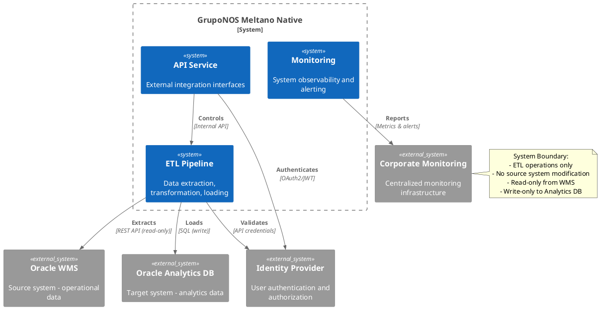

### 3.4 External Interfaces

#### Data Interfaces

| Interface | Protocol | Direction | Frequency | Volume |
|-----------|----------|-----------|-----------|--------|
| **WMS REST API** | HTTPS/JSON | Inbound | Continuous | 10K-50K records/hour |
| **Analytics DB** | SQL/TCP | Outbound | Batch | 1K-10K records/load |
| **Monitoring API** | HTTPS/JSON | Outbound | Continuous | 100 metrics/minute |

#### Management Interfaces

| Interface | Purpose | Users | Authentication |
|-----------|---------|-------|----------------|
| **CLI Interface** | Pipeline operations | Data engineers | OS credentials |
| **REST API** | System integration | External systems | JWT tokens |
| **Monitoring Dashboard** | System observability | Operations team | SSO |

---

## 4. Solution Strategy

### 4.1 Technology Strategy

#### Core Technology Choices

| Concern | Technology | Rationale |
|---------|------------|-----------|
| **Language** | Python 3.13+ | Type safety, ecosystem maturity, data science capabilities |
| **Orchestration** | Meltano 3.8.0 | Native ELT framework, Singer ecosystem, proven reliability |
| **Data Integration** | Singer Protocol | Standard specification, rich plugin ecosystem |
| **Configuration** | Pydantic v2 | Type-safe configuration, validation, serialization |
| **Error Handling** | Railway Pattern | Functional error handling, composability |
| **Dependency Injection** | FLEXT Container | Centralized service management, testability |

#### Architecture Principles

1. **Clean Architecture**: Strict separation between business logic and infrastructure
2. **Railway Pattern**: Functional error handling throughout the application
3. **Domain-Driven Design**: Business concepts modeled explicitly
4. **Test-Driven Development**: High test coverage with comprehensive validation
5. **Infrastructure as Code**: Automated deployment and configuration management

### 4.2 Design Decisions

#### Pipeline Architecture Decision

**Decision**: Implement dual pipeline architecture (full sync + incremental sync)

**Rationale**:
- **Full Sync**: Handles schema changes, data reconciliation, comprehensive updates
- **Incremental Sync**: Provides data freshness, reduces processing overhead
- **Separation of Concerns**: Different performance characteristics and business requirements

**Trade-offs**:
- **Positive**: Optimized performance, flexible scheduling, independent scaling
- **Negative**: Increased complexity, configuration duplication, maintenance overhead

#### Native Meltano Decision

**Decision**: Use Meltano 3.8.0 native orchestration instead of abstracted wrapper

**Rationale**:
- **Direct Control**: Full access to Meltano capabilities and configuration
- **Performance**: Reduced abstraction overhead
- **Integration**: Native plugin ecosystem and community support
- **Future-Proofing**: Direct updates from Meltano project

**Trade-offs**:
- **Positive**: Maximum flexibility, latest features, community support
- **Negative**: Tighter coupling, manual plugin management, version compatibility

### 4.3 Quality Measures

#### Code Quality
- **Type Coverage**: 100% type annotations with Pyrefly strict mode
- **Test Coverage**: 90%+ code coverage with comprehensive integration tests
- **Linting**: Ruff with zero violations across all code
- **Documentation**: Arc42 + C4 model with automated maintenance

#### Architecture Quality
- **Clean Architecture**: Verified separation of concerns
- **SOLID Principles**: Single responsibility, open/closed, dependency inversion
- **DRY Principle**: Eliminated code duplication through shared libraries
- **YAGNI Principle**: Focused on current requirements without over-engineering

---

## 5. Building Block View

### 5.1 Level 1: System Overview

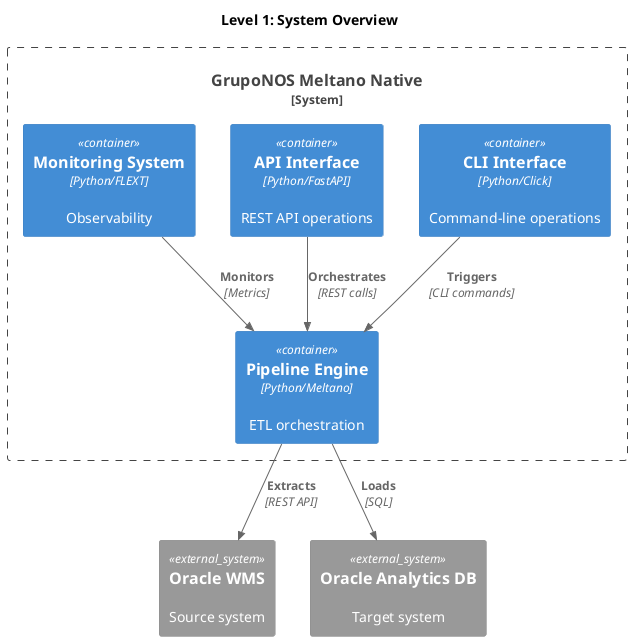

### 5.2 Level 2: Pipeline Engine Breakdown

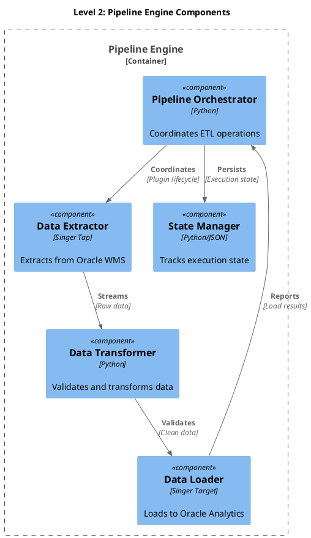

### 5.3 Level 3: Component Internal Structure

#### Pipeline Orchestrator Internal Structure

```plantuml
@startuml Building_Block_Level3_Orchestrator
!include <C4/C4_Code>

title Level 3: Orchestrator Internal Structure

Package "orchestrator" as orch {
    Class "GruponosMeltanoOrchestrator" as main_orch
    Class "PipelineExecutor" as executor
    Class "JobScheduler" as scheduler
    Class "PluginCoordinator" as coordinator
    Class "StateManager" as state_mgr
    Class "ErrorHandler" as error_handler
}

' Internal relationships
main_orch --> executor : uses
main_orch --> scheduler : manages
main_orch --> coordinator : coordinates
main_orch --> state_mgr : persists
main_orch --> error_handler : handles

executor --> coordinator : delegates
scheduler --> executor : triggers
coordinator --> error_handler : reports
@enduml
```

---

## 6. Runtime View

### 6.1 Full Sync Pipeline Runtime

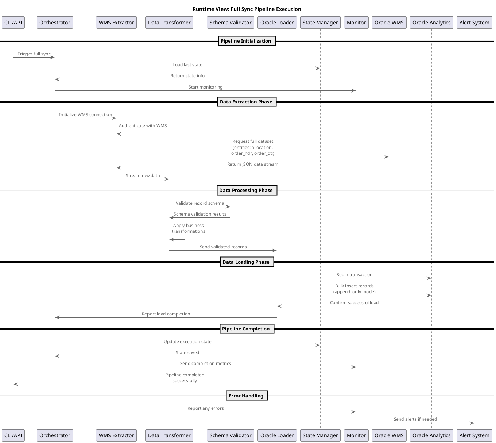

### 6.2 Incremental Sync Pipeline Runtime

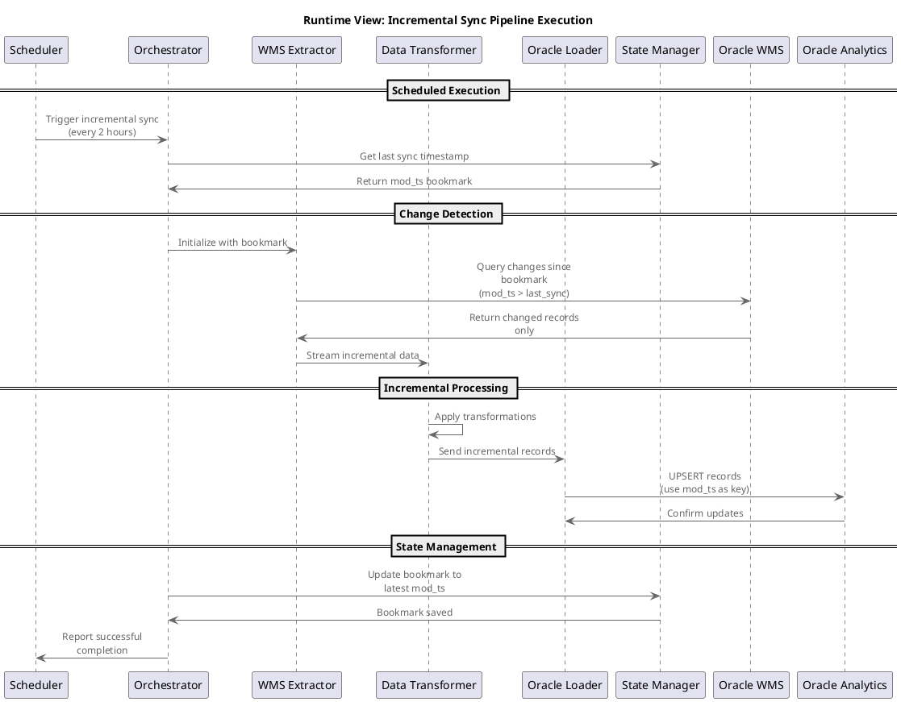

### 6.3 Error Recovery Scenarios

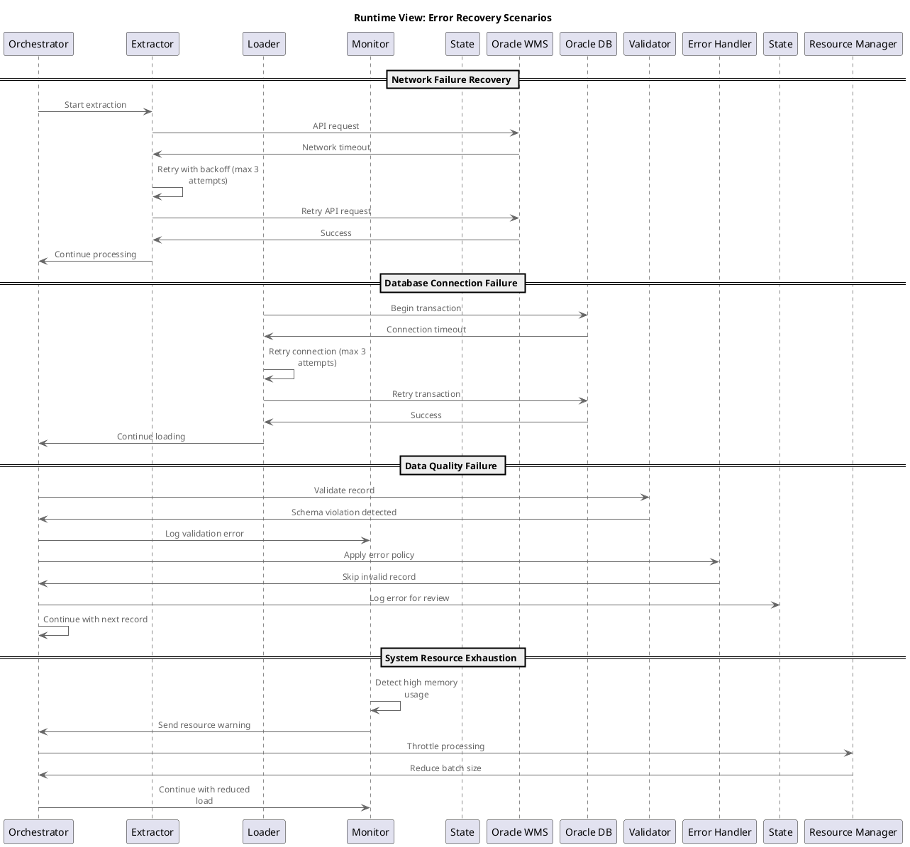

---

## 7. Deployment View

### 7.1 Infrastructure Overview

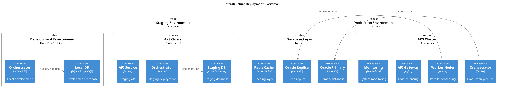

### 7.2 Container Configuration

#### Orchestrator Container

```dockerfile
# Dockerfile for Pipeline Orchestrator
FROM python:3.13-slim

# Install system dependencies
RUN apt-get update && apt-get install -y \
    curl \
    git \
    && rm -rf /var/lib/apt/lists/*

# Install Poetry
RUN pip install poetry

# Set work directory
WORKDIR /app

# Copy dependency files
COPY pyproject.toml poetry.lock ./

# Install Python dependencies
RUN poetry config virtualenvs.create false \
    && poetry install --no-dev --no-interaction

# Copy application code
COPY src/ ./src/

# Create non-root user
RUN useradd --create-home --shell /bin/bash app \
    && chown -R app:app /app
USER app

# Health check
HEALTHCHECK --interval=30s --timeout=10s --start-period=5s --retries=3 \
    CMD curl -f http://localhost:8000/health || exit 1

# Expose port
EXPOSE 8000

# Start application
CMD ["python", "-m", "gruponos_meltano_native.cli", "serve"]
```

#### Infrastructure Requirements

| Environment | CPU | Memory | Storage | Network |
|-------------|-----|--------|---------|---------|
| **Development** | 2 cores | 4GB | 50GB | 100Mbps |
| **Staging** | 4 cores | 8GB | 100GB | 500Mbps |
| **Production** | 8-16 cores | 16-32GB | 500GB | 1Gbps |

### 7.3 Configuration Management

#### Environment Configuration

```yaml
# config/environments/dev.yml
environment: development
debug: true
log_level: DEBUG

pipeline:
  batch_size: 100
  timeout: 300
  retries: 1

database:
  host: localhost
  port: 5432
  database: gruponos_dev
  ssl_mode: disable

monitoring:
  enabled: false
  metrics_interval: 60
```

```yaml
# config/environments/prod.yml
environment: production
debug: false
log_level: INFO

pipeline:
  batch_size: 5000
  timeout: 1800
  retries: 3

database:
  host: oracle-prod.company.com
  port: 1521
  database: gruponos_prod
  ssl_mode: require

monitoring:
  enabled: true
  metrics_interval: 30
  alerts_enabled: true
```

---

## 8. Concepts (Cross-cutting Concerns)

### 8.1 Domain Concepts

#### Core Business Entities

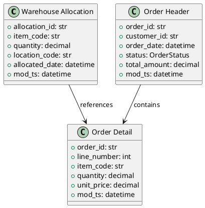

#### Business Rules

1. **Allocation Consistency**: Total allocated quantity cannot exceed available inventory
2. **Order Integrity**: Order details must reference valid order headers
3. **Data Freshness**: Incremental updates must use modification timestamp
4. **Schema Validation**: All data must conform to predefined schemas

### 8.2 Error Handling Concept

#### Railway Pattern Implementation

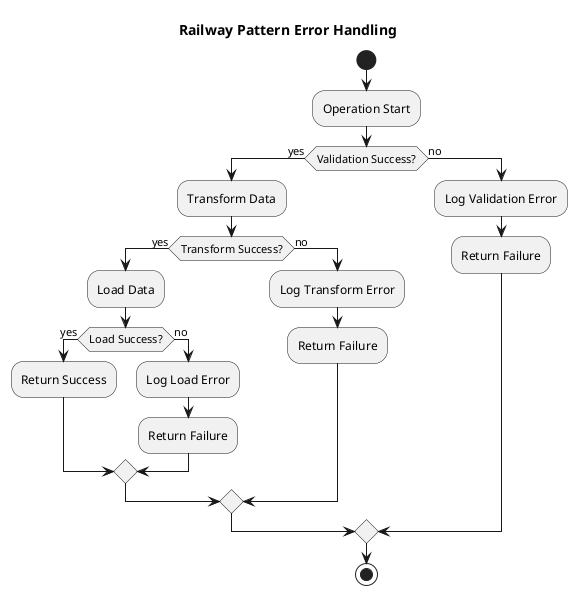

### 8.3 Security Concepts

#### Authentication & Authorization

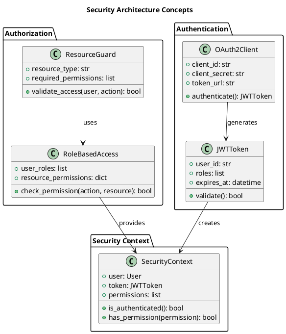

### 8.4 Performance Concepts

#### Caching Strategy

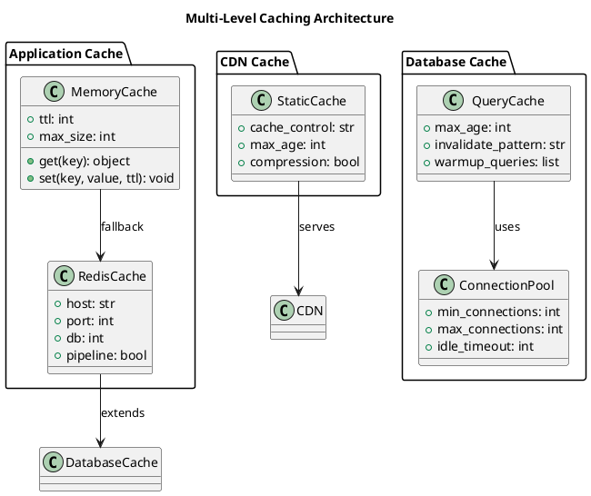

---

## 9. Architecture Decisions

### 9.1 Architectural Decision Records (ADRs)

#### ADR 001: Technology Stack Selection

**Status**: Accepted | **Date**: 2025-01-15

**Context**: Need to select technology stack for enterprise ETL pipeline with Oracle WMS integration.

**Decision**: Use Python 3.13+ with Meltano 3.8.0 orchestration, FLEXT ecosystem libraries, and Pydantic for configuration.

**Rationale**:
- Python provides excellent data processing capabilities
- Meltano offers proven ELT orchestration with Singer ecosystem
- FLEXT provides enterprise patterns and shared infrastructure
- Pydantic ensures type-safe configuration management

**Consequences**:
- **Positive**: Strong ecosystem support, type safety, proven patterns
- **Negative**: Python GIL limitations for CPU-intensive tasks
- **Risks**: Dependency on FLEXT ecosystem maintenance

#### ADR 002: Pipeline Architecture Pattern

**Status**: Accepted | **Date**: 2025-02-01

**Decision**: Implement dual pipeline architecture with separate full sync and incremental sync pipelines.

**Context**: Need to balance data freshness requirements with processing efficiency.

**Rationale**:
- Full sync ensures data consistency and handles schema changes
- Incremental sync provides real-time data freshness
- Separation allows independent scaling and optimization

**Consequences**:
- **Positive**: Optimized performance, flexible scheduling, independent scaling
- **Negative**: Increased complexity, configuration duplication
- **Mitigation**: Shared configuration management and monitoring

#### ADR 003: Error Handling Strategy

**Status**: Accepted | **Date**: 2025-02-15

**Decision**: Implement railway pattern with FlextResult[T] throughout the application.

**Context**: Need robust error handling for enterprise data pipeline with complex failure scenarios.

**Rationale**:
- Railway pattern provides composable error handling
- FlextResult[T] ensures type safety in error scenarios
- Functional approach prevents exception-based control flow

**Consequences**:
- **Positive**: Predictable error handling, type safety, composability
- **Negative**: Learning curve for functional programming concepts
- **Training**: Team training on railway pattern implementation

### 9.2 Decision Log

| Date | Decision | Status | Impact |
|------|----------|--------|---------|
| 2025-01-15 | Technology Stack | Accepted | Foundation |
| 2025-02-01 | Pipeline Architecture | Accepted | Core Design |
| 2025-02-15 | Error Handling | Accepted | Implementation |
| 2025-03-01 | Deployment Strategy | Accepted | Operations |
| 2025-03-15 | Monitoring Strategy | Accepted | Observability |

---

## 10. Quality Requirements

### 10.1 Quality Tree

```plantuml
@startuml Quality_Tree
mindmap
  root((Quality Requirements))
    **Functional**
      ++ Data Accuracy
        +++ 99.9% accuracy requirement
        +++ Schema validation
        +++ Business rule enforcement
      ++ Data Completeness
        +++ 99.5% completeness
        +++ Referential integrity
        +++ Required field validation
      ++ Data Freshness
        +++ Full sync: weekly
        +++ Incremental: 2 hours
        +++ Real-time alerting
    **Performance**
      ++ Throughput
        +++ Full sync: 100K records/30min
        +++ Incremental: 10K records/5min
        +++ API response: <2 seconds
      ++ Scalability
        +++ Horizontal scaling support
        +++ Resource utilization <80%
        +++ Auto-scaling capabilities
      ++ Efficiency
        +++ Memory usage <2GB
        +++ CPU utilization optimization
        +++ Network bandwidth optimization
    **Security**
      ++ Authentication
        +++ JWT token validation
        +++ Multi-factor authentication
        +++ Session management
      ++ Authorization
        +++ Role-based access control
        +++ Principle of least privilege
        +++ Permission granularity
      ++ Data Protection
        +++ End-to-end encryption
        +++ Data masking for sensitive fields
        +++ Audit trail completeness
    **Reliability**
      ++ Availability
        +++ 99.5% uptime SLA
        +++ Automatic failover
        +++ Graceful degradation
      ++ Fault Tolerance
        +++ Circuit breaker pattern
        +++ Retry mechanisms
        +++ Error recovery procedures
      ++ Resilience
        +++ Self-healing capabilities
        +++ Monitoring and alerting
        +++ Incident response automation
    **Maintainability**
      ++ Code Quality
        +++ 90%+ test coverage
        +++ Zero linting violations
        +++ Type safety compliance
      ++ Documentation
        +++ Arc42 + C4 model coverage
        +++ Automated maintenance
        +++ Up-to-date API docs
      ++ Operability
        +++ Automated deployment
        +++ Configuration management
        +++ Runbook completeness
@enduml
```

### 10.2 Quality Scenarios

#### Performance Scenario: High Volume Data Load
- **Stimulus**: 100,000 records arrive for processing
- **Environment**: Normal production load
- **Response**: Process completes within 30 minutes
- **Measure**: 99% of records processed successfully, <5% resource utilization spike

#### Reliability Scenario: Network Failure
- **Stimulus**: Network connection to Oracle WMS fails
- **Environment**: Peak business hours
- **Response**: Automatic retry with exponential backoff
- **Measure**: Recovery within 5 minutes, no data loss

#### Security Scenario: Unauthorized Access Attempt
- **Stimulus**: Invalid authentication token presented
- **Environment**: Production API endpoint
- **Response**: Immediate rejection with audit logging
- **Measure**: No access granted, full audit trail captured

---

## 11. Risks & Technical Debt

### 11.1 Identified Risks

#### High Risk Items

| Risk | Probability | Impact | Mitigation |
|------|-------------|--------|------------|
| **FLEXT Dependency Failure** | Medium | High | Local testing, version pinning, contingency plans |
| **Oracle WMS API Changes** | Low | High | Contractual agreements, monitoring, adapter pattern |
| **Data Volume Growth** | High | Medium | Scalability design, performance monitoring, capacity planning |
| **Security Vulnerabilities** | Medium | High | Regular security audits, dependency scanning, patch management |

#### Medium Risk Items

| Risk | Probability | Impact | Mitigation |
|------|-------------|--------|------------|
| **Team Knowledge Gap** | High | Medium | Training programs, documentation, knowledge sharing |
| **Third-party Service Outages** | Medium | Medium | Circuit breakers, fallback mechanisms, monitoring |
| **Configuration Drift** | Medium | Medium | Infrastructure as code, automated validation |
| **Performance Degradation** | Medium | Medium | Performance monitoring, profiling, optimization |

### 11.2 Technical Debt

#### Code Quality Debt

| Item | Severity | Effort | Priority |
|------|----------|--------|----------|
| **Test Coverage Gaps** | Medium | 2 weeks | High |
| **Documentation Synchronization** | Low | 1 week | Medium |
| **Configuration Validation** | Medium | 1 week | High |
| **Error Message Standardization** | Low | 3 days | Low |

#### Architecture Debt

| Item | Severity | Effort | Priority |
|------|----------|--------|----------|
| **Dependency Path Hardcoding** | High | 2 weeks | Critical |
| **Monitoring Integration** | Medium | 1 week | High |
| **Security Hardening** | Medium | 2 weeks | High |
| **Performance Optimization** | Low | 3 weeks | Medium |

#### Infrastructure Debt

| Item | Severity | Effort | Priority |
|------|----------|--------|----------|
| **Deployment Automation** | Medium | 2 weeks | High |
| **Environment Consistency** | Medium | 1 week | Medium |
| **Backup and Recovery** | High | 3 weeks | High |
| **Disaster Recovery** | High | 4 weeks | Critical |

### 11.3 Risk Mitigation Strategies

#### Proactive Measures
1. **Regular Security Audits**: Monthly dependency vulnerability scanning
2. **Performance Monitoring**: Continuous resource utilization tracking
3. **Automated Testing**: Comprehensive CI/CD pipeline with quality gates
4. **Documentation Maintenance**: Automated documentation synchronization

#### Contingency Plans
1. **Dependency Failure**: Local library forks, alternative implementations
2. **Service Outage**: Circuit breaker patterns, graceful degradation
3. **Data Loss**: Point-in-time recovery, backup validation
4. **Security Breach**: Incident response plan, forensic capabilities

---

## 12. Glossary

### A

**ADR (Architecture Decision Record)**: Document capturing architectural decisions, context, and rationale

**API (Application Programming Interface)**: Contract defining how software components interact

**Arc42**: Template for comprehensive software architecture documentation

### C

**C4 Model**: Hierarchical model for software architecture documentation (Context, Containers, Components, Code)

**CI/CD**: Continuous Integration/Continuous Deployment - automated software delivery pipeline

**Container**: Lightweight, standalone executable package including code, runtime, and dependencies

### D

**DDD (Domain-Driven Design)**: Software development approach focusing on business domain modeling

**Docker**: Platform for developing, shipping, and running containerized applications

### E

**ETL (Extract, Transform, Load)**: Data integration process extracting data from sources, transforming it, and loading into targets

**ELT (Extract, Load, Transform)**: Variation of ETL where transformation occurs after loading

### F

**FLEXT**: Enterprise data integration platform with Clean Architecture and DDD patterns

**FastAPI**: Modern, fast web framework for building APIs with Python 3.7+

### J

**JWT (JSON Web Token)**: Compact, URL-safe means of representing claims between parties

### K

**Kubernetes**: Open-source system for automating deployment, scaling, and management of containerized applications

### M

**Meltano**: Open-source platform for building and running ELT pipelines

### O

**OAuth2**: Open standard for access delegation, commonly used for token-based authentication

### P

**Pydantic**: Data validation and settings management using Python type annotations

**Python 3.13**: Latest stable version of Python programming language

### R

**RBAC (Role-Based Access Control)**: Access control method based on user roles and permissions

**REST (Representational State Transfer)**: Architectural style for distributed systems

### S

**Singer**: Open standard for data integration between databases, SaaS APIs, and files

**SOLID**: Five design principles for object-oriented programming and design

**SQL**: Structured Query Language for managing relational databases

### T

**TCP (Transmission Control Protocol)**: Connection-oriented protocol for reliable data transmission

### W

**WMS (Warehouse Management System)**: Software for managing warehouse operations and inventory

---

**Arc42 Documentation** - Comprehensive software architecture documentation following industry-standard template with C4 model integration for clear communication of system design and implementation details.