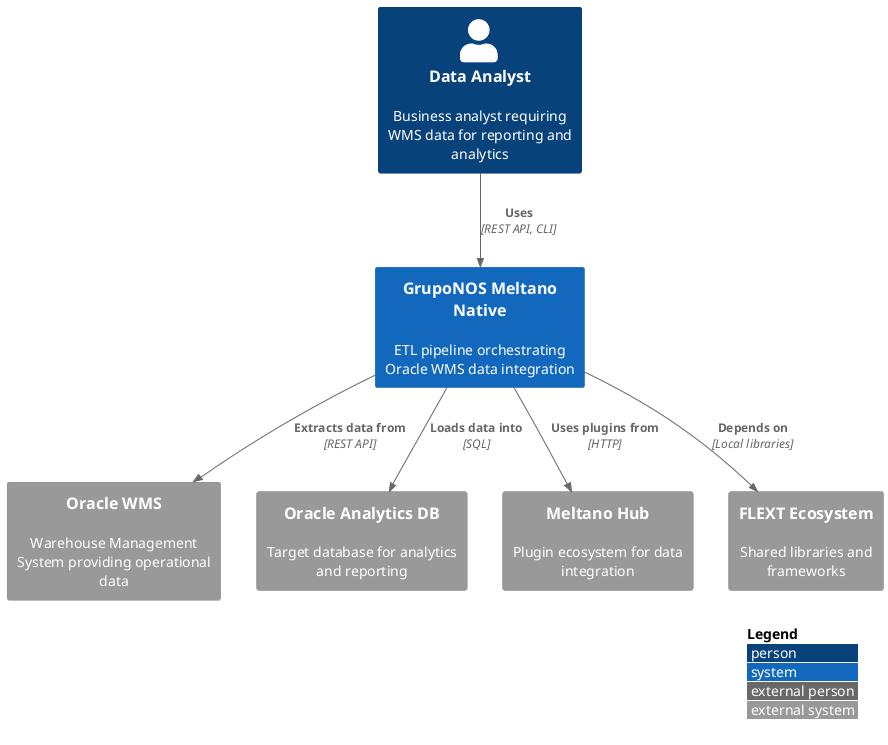
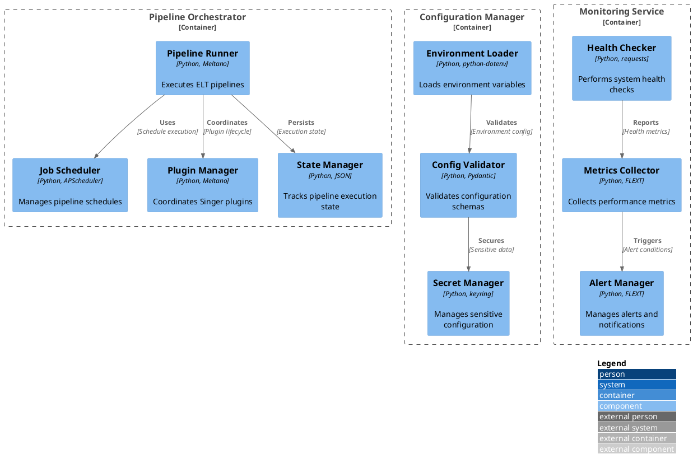
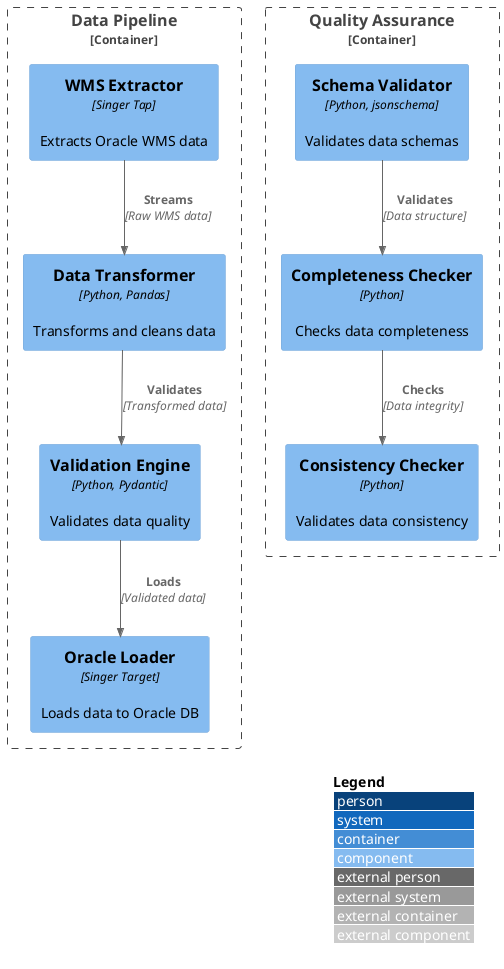
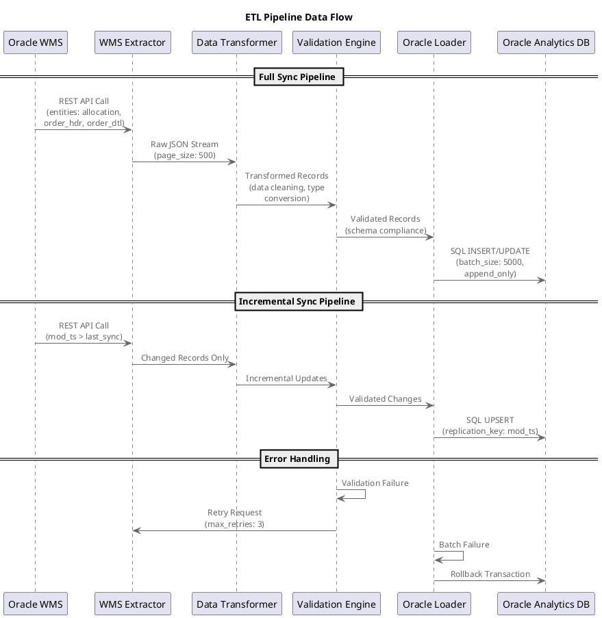
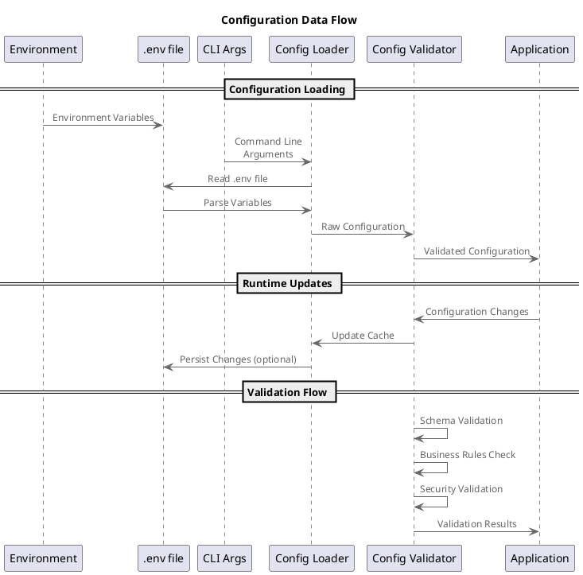
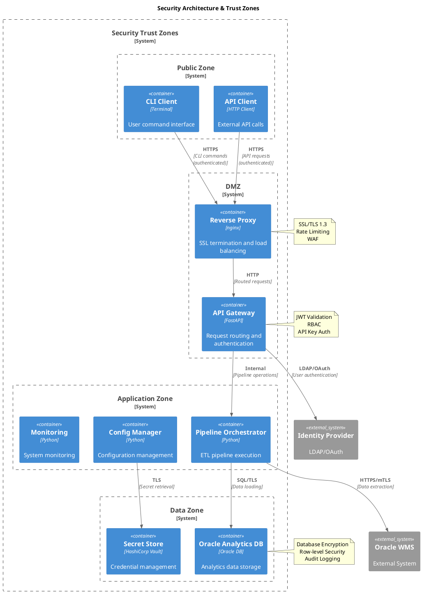
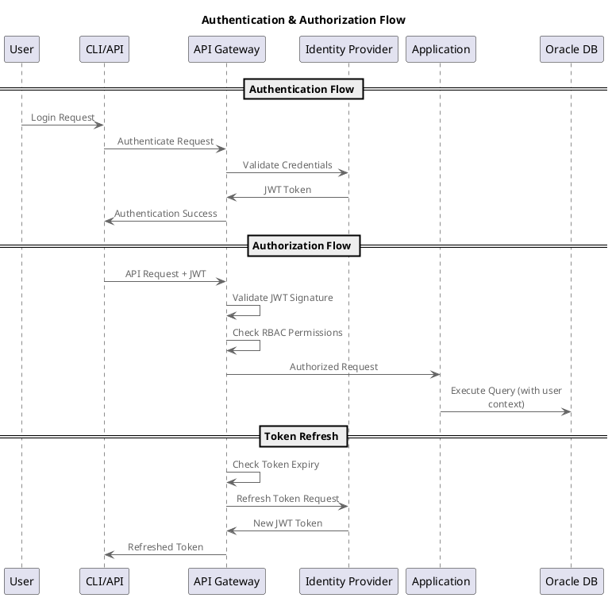
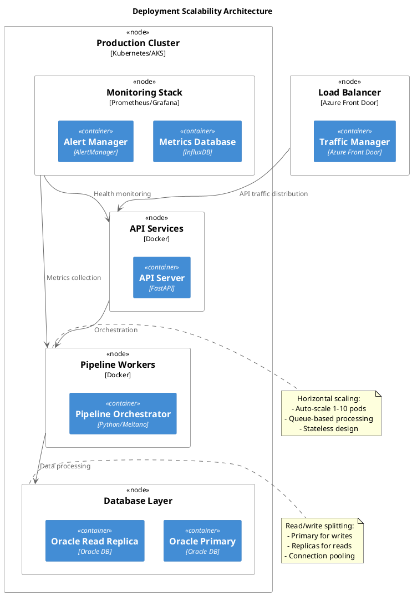
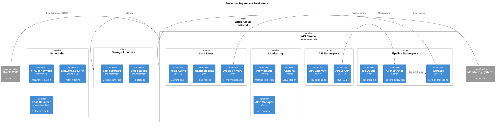

# C4 Model Architecture Documentation
## Table of Contents

- [C4 Model Architecture Documentation](#c4-model-architecture-documentation)
  - [📋 C4 Model Overview](#-c4-model-overview)
  - [🌐 1. System Context (C4 Level 1)](#-1-system-context-c4-level-1)
    - [System Purpose](#system-purpose)
    - [Context Diagram](#context-diagram)
    - [Key Relationships](#key-relationships)
  - [🏗️ 2. Container Architecture (C4 Level 2)](#-2-container-architecture-c4-level-2)
    - [Container Diagram](#container-diagram)
    - [Container Descriptions](#container-descriptions)
      - [**CLI Application**](#cli-application)
      - [**API Service**](#api-service)
      - [**Pipeline Orchestrator**](#pipeline-orchestrator)
      - [**Configuration Manager**](#configuration-manager)
      - [**Monitoring Service**](#monitoring-service)
  - [🔧 3. Component Architecture (C4 Level 3)](#-3-component-architecture-c4-level-3)
    - [ETL Pipeline Components](#etl-pipeline-components)
    - [Data Flow Components](#data-flow-components)
    - [Component Details](#component-details)
      - [**Pipeline Runner**](#pipeline-runner)
      - [**Plugin Manager**](#plugin-manager)
      - [**Configuration Validator**](#configuration-validator)
  - [💻 4. Code Architecture (C4 Level 4)](#-4-code-architecture-c4-level-4)
    - [Package Structure](#package-structure)
    - [Key Classes and Relationships](#key-classes-and-relationships)
      - [**Main Application Classes**](#main-application-classes)
      - [**Domain Model Classes**](#domain-model-classes)
      - [**Infrastructure Classes**](#infrastructure-classes)
  - [🔄 5. Data Flow Architecture](#-5-data-flow-architecture)
    - [ETL Pipeline Data Flow](#etl-pipeline-data-flow)
    - [Configuration Data Flow](#configuration-data-flow)
  - [🛡️ 6. Security Architecture](#-6-security-architecture)
    - [Security Boundaries](#security-boundaries)
    - [Authentication & Authorization](#authentication--authorization)
  - [📊 7. Performance & Scalability](#-7-performance--scalability)
    - [Performance Characteristics](#performance-characteristics)
    - [Scalability Patterns](#scalability-patterns)
  - [📋 8. Architecture Decision Records (ADRs)](#-8-architecture-decision-records-adrs)
    - [ADR Template](#adr-template)
- [ADR [Number]: [Title]](#adr-number-title)
  - [Status](#status)
  - [Context](#context)
  - [Decision](#decision)
  - [Consequences](#consequences)
    - [Positive](#positive)
    - [Negative](#negative)
    - [Risks](#risks)
  - [Alternatives Considered](#alternatives-considered)
  - [Implementation Notes](#implementation-notes)
  - [References](#references)
    - [Current ADRs](#current-adrs)
      - [**ADR 001: Native Meltano Orchestration**](#adr-001-native-meltano-orchestration)
      - [**ADR 002: Dual Pipeline Architecture**](#adr-002-dual-pipeline-architecture)
      - [**ADR 003: Railway Pattern for Error Handling**](#adr-003-railway-pattern-for-error-handling)
  - [🔧 9. Deployment Architecture](#-9-deployment-architecture)
    - [Production Deployment](#production-deployment)
    - [Infrastructure Requirements](#infrastructure-requirements)
  - [🎯 Summary](#-summary)
    - [Architecture Highlights](#architecture-highlights)
    - [Key Architectural Decisions](#key-architectural-decisions)
    - [Quality Attributes](#quality-attributes)


**Project**: gruponos-meltano-native | **Version**: 0.9.0 | **Framework**: C4 Model + PlantUML
**Last Updated**: 2025-10-10 | **Status**: Production-Ready ETL Pipeline

---

## 📋 C4 Model Overview

This document provides a comprehensive architectural view of the gruponos-meltano-native system using the C4 model approach:

- **Context (Level 1)**: System in its environment
- **Containers (Level 2)**: High-level technology choices
- **Components (Level 3)**: Major building blocks
- **Code (Level 4)**: Implementation details

---

## 🌐 1. System Context (C4 Level 1)

### System Purpose
**gruponos-meltano-native** is an enterprise-grade ETL pipeline that orchestrates data integration between Oracle Warehouse Management System (WMS) and downstream analytics databases using Meltano orchestration platform.

### Context Diagram



### Key Relationships

| Component | Relationship | Purpose | Technology |
|-----------|-------------|---------|------------|
| **Data Analyst** | Uses system | Access WMS data for analytics | REST API, CLI |
| **Oracle WMS** | Data source | Provides warehouse operational data | REST API |
| **Oracle Analytics DB** | Data target | Stores transformed analytics data | SQL |
| **Meltano Hub** | Plugin ecosystem | Provides extraction/loading plugins | HTTP |
| **FLEXT Ecosystem** | Shared libraries | Provides common patterns and utilities | Local dependencies |

---

## 🏗️ 2. Container Architecture (C4 Level 2)

### Container Diagram

```plantuml
@startuml C4_Container
!include <C4/C4_Container>

LAYOUT_WITH_LEGEND()

System_Boundary(gruponos_meltano_native, "GrupoNOS Meltano Native") {
    Container(cli_app, "CLI Application", "Python 3.13, Click", "Command-line interface for pipeline management")
    Container(api_service, "API Service", "Python 3.13, FastAPI", "REST API for pipeline operations")
    Container(orchestrator, "Pipeline Orchestrator", "Python 3.13, Meltano", "ETL pipeline execution engine")
    Container(config_manager, "Configuration Manager", "Python 3.13, Pydantic",
     "Environment and pipeline configuration")
    Container(monitoring, "Monitoring Service", "Python 3.13, FLEXT", "Observability and alerting")
}

System_Boundary(flext_ecosystem, "FLEXT Ecosystem") {
    Container(flext_core, "FLEXT Core", "Python 3.13", "Foundation patterns and utilities")
    Container(flext_db_oracle, "FLEXT Oracle DB", "Python 3.13, cx_Oracle", "Oracle database connectivity")
    Container(flext_tap_wms, "FLEXT WMS Tap", "Python 3.13, Singer", "Oracle WMS data extraction")
    Container(flext_target_oracle, "FLEXT Oracle Target", "Python 3.13, Singer", "Oracle database loading")
}

System_Ext(meltano_runtime, "Meltano Runtime", "Python, Docker", "ELT orchestration platform")
System_Ext(oracle_wms, "Oracle WMS", "Oracle Database, REST API", "Warehouse management data source")
System_Ext(oracle_analytics, "Oracle Analytics DB", "Oracle Database", "Analytics data warehouse")

Rel(cli_app, orchestrator, "Triggers", "CLI commands")
Rel(api_service, orchestrator, "Controls", "REST API")
Rel(orchestrator, meltano_runtime, "Uses", "Process execution")
Rel(orchestrator, config_manager, "Reads", "Configuration")
Rel(monitoring, orchestrator, "Monitors", "Metrics collection")

Rel(orchestrator, flext_tap_wms, "Extracts via", "Singer protocol")
Rel(orchestrator, flext_target_oracle, "Loads via", "Singer protocol")
Rel(flext_tap_wms, oracle_wms, "Reads from", "REST API")
Rel(flext_target_oracle, oracle_analytics, "Writes to", "SQL")

Rel(flext_tap_wms, flext_core, "Uses", "Railway patterns")
Rel(flext_target_oracle, flext_db_oracle, "Uses", "Database connectivity")
Rel(orchestrator, flext_core, "Uses", "Result patterns, DI")

@enduml
```

### Container Descriptions

#### **CLI Application**
- **Technology**: Python 3.13, Click framework
- **Purpose**: Command-line interface for pipeline operations
- **Responsibilities**:
  - Pipeline execution triggers
  - Configuration management
  - Status monitoring
  - Interactive operations

#### **API Service**
- **Technology**: Python 3.13, FastAPI
- **Purpose**: REST API for programmatic access
- **Responsibilities**:
  - Pipeline orchestration via HTTP
  - Status monitoring endpoints
  - Configuration management
  - Integration with external systems

#### **Pipeline Orchestrator**
- **Technology**: Python 3.13, Meltano 3.8.0
- **Purpose**: Core ETL orchestration engine
- **Responsibilities**:
  - Meltano pipeline execution
  - Plugin coordination
  - Error handling and recovery
  - Progress monitoring

#### **Configuration Manager**
- **Technology**: Python 3.13, Pydantic v2
- **Purpose**: Centralized configuration management
- **Responsibilities**:
  - Environment variable handling
  - Pipeline configuration validation
  - Runtime configuration updates
  - Secret management

#### **Monitoring Service**
- **Technology**: Python 3.13, FLEXT Observability
- **Purpose**: System observability and alerting
- **Responsibilities**:
  - Metrics collection
  - Performance monitoring
  - Error alerting
  - Health checks

---

## 🔧 3. Component Architecture (C4 Level 3)

### ETL Pipeline Components



### Data Flow Components



### Component Details

#### **Pipeline Runner**
- **Responsibilities**:
  - Execute Meltano ELT pipelines
  - Handle pipeline failures and retries
  - Coordinate between extractors and loaders
  - Manage pipeline execution state
- **Key Classes**: `GruponosMeltanoOrchestrator`, `PipelineRunner`
- **Dependencies**: Meltano runtime, FLEXT core

#### **Plugin Manager**
- **Responsibilities**:
  - Install and configure Singer plugins
  - Manage plugin lifecycle
  - Handle plugin communication
  - Coordinate data flow between plugins
- **Key Classes**: `PluginManager`, `SingerCoordinator`
- **Dependencies**: Meltano plugin system, Singer protocol

#### **Configuration Validator**
- **Responsibilities**:
  - Validate pipeline configuration schemas
  - Check environment variable completeness
  - Verify plugin configuration compatibility
  - Ensure security requirements are met
- **Key Classes**: `GruponosMeltanoConfig`, `ConfigValidator`
- **Dependencies**: Pydantic v2, custom validation rules

---

## 💻 4. Code Architecture (C4 Level 4)

### Package Structure

```plantuml
@startuml C4_Code_Packages
!include <C4/C4_Code>

LAYOUT_WITH_LEGEND()

Package "gruponos_meltano_native" as pkg_main {
    Package "cli" as cli_pkg {
        Class "GruponosMeltanoNativeCli" as cli_class
        Class "CommandParser" as cmd_parser
        Class "OutputFormatter" as formatter
    }

    Package "orchestrator" as orch_pkg {
        Class "GruponosMeltanoOrchestrator" as orchestrator_class
        Class "PipelineExecutor" as executor
        Class "StateManager" as state_mgr
    }

    Package "config" as config_pkg {
        Class "GruponosMeltanoNativeConfig" as config_class
        Class "EnvironmentLoader" as env_loader
        Class "ConfigValidator" as validator
    }

    Package "models" as models_pkg {
        Class "GruponosMeltanoModels" as models_class
        Class "WmsAllocation" as alloc_model
        Class "OrderHeader" as order_hdr
        Class "OrderDetail" as order_dtl
    }

    Package "infrastructure" as infra_pkg {
        Package "di_container" as di_pkg {
            Class "GruponosMeltanoDiContainer" as di_class
        }
        Package "oracle" as oracle_pkg {
            Class "OracleConnectionManager" as conn_mgr
        }
    }

    Package "validators" as validators_pkg {
        Class "DataValidator" as data_validator
        Class "SchemaValidator" as schema_validator
    }

    Package "monitoring" as monitoring_pkg {
        Class "AlertManager" as alert_mgr
        Class "MetricsCollector" as metrics_coll
    }
}

Package "flext_core" as flext_core {
    Class "FlextResult" as result_class
    Class "FlextContainer" as container_class
    Class "FlextModels" as models_base
}

Package "meltano" as meltano {
    Class "Pipeline" as pipeline_class
    Class "Plugin" as plugin_class
}

' Relationships
cli_class --> orchestrator_class : triggers
orchestrator_class --> config_class : reads
orchestrator_class --> models_class : uses
orchestrator_class --> di_class : depends

config_class --> result_class : extends
models_class --> models_base : extends
di_class --> container_class : uses

orchestrator_class --> pipeline_class : uses
orchestrator_class --> plugin_class : coordinates

@enduml
```

### Key Classes and Relationships

#### **Main Application Classes**

| Class | Purpose | Key Methods | Dependencies |
|-------|---------|-------------|--------------|
| `GruponosMeltanoNativeCli` | CLI interface | `main()`, `run_pipeline()` | Click, orchestrator |
| `GruponosMeltanoOrchestrator` | Pipeline execution | `execute_pipeline()`, `validate_config()` | Meltano, FLEXT core |
| `GruponosMeltanoNativeConfig` | Configuration | `load_env()`, `validate()` | Pydantic, python-dotenv |

#### **Domain Model Classes**

| Class | Purpose | Key Attributes | Validation |
|-------|---------|----------------|------------|
| `WmsAllocation` | Warehouse allocation data | `allocation_id`, `item_code`, `quantity` | Pydantic v2 |
| `OrderHeader` | Order header information | `order_id`, `customer_id`, `order_date` | Business rules |
| `OrderDetail` | Order line items | `line_id`, `item_code`, `quantity` | Referential integrity |

#### **Infrastructure Classes**

| Class | Purpose | Key Methods | Technologies |
|-------|---------|-------------|--------------|
| `GruponosMeltanoDiContainer` | Dependency injection | `register()`, `get()` | FLEXT container |
| `OracleConnectionManager` | Database connectivity | `connect()`, `execute()` | cx_Oracle, FLEXT DB |
| `AlertManager` | Alert handling | `send_alert()`, `check_thresholds()` | FLEXT observability |

---

## 🔄 5. Data Flow Architecture

### ETL Pipeline Data Flow



### Configuration Data Flow



---

## 🛡️ 6. Security Architecture

### Security Boundaries



### Authentication & Authorization



---

## 📊 7. Performance & Scalability

### Performance Characteristics

```plantuml
@startuml Performance_Profile
title ETL Pipeline Performance Characteristics

scale 0.8

' Performance metrics over time
clock "Time" as t

rectangle "Data Volume" as volume [
  Full Sync: 100K-1M records
  Incremental: 1K-10K records/hour
  Peak Load: 50K records/minute
]

rectangle "Response Times" as response [
  Full Sync: 30-120 minutes
  Incremental: 5-15 minutes
  API Response: <2 seconds
]

rectangle "Resource Usage" as resources [
  CPU: 20-80% (4 cores)
  Memory: 512MB-2GB
  Network: 10-100 Mbps
  Storage: 1-10 GB temp files
]

' Scaling relationships
volume --> response : Direct correlation
response --> resources : Resource consumption
resources --> volume : Capacity limits

note right : Performance degrades with\nlarge datasets. Consider\npartitioning for >1M records.
@enduml
```

### Scalability Patterns



---

## 📋 8. Architecture Decision Records (ADRs)

### ADR Template

```markdown
# ADR [Number]: [Title]

## Status
[Proposed | Accepted | Rejected | Deprecated | Superseded]

## Context
[Describe the context and problem statement]

## Decision
[Describe the decision made and the solution]

## Consequences
### Positive
- [List positive consequences]

### Negative
- [List negative consequences]

### Risks
- [List risks and mitigation strategies]

## Alternatives Considered
- [List alternatives and why they were not chosen]

## Implementation Notes
[Technical details, code references, testing considerations]

## References
- [Links to related documents, issues, PRs]
```

### Current ADRs

#### **ADR 001: Native Meltano Orchestration**
- **Status**: Accepted
- **Decision**: Use Meltano 3.8.0 native orchestration instead of flext-meltano wrapper
- **Rationale**: Direct control, better integration, reduced abstraction overhead
- **Consequences**: Tighter coupling to Meltano, direct plugin management

#### **ADR 002: Dual Pipeline Architecture**
- **Status**: Accepted
- **Decision**: Implement separate full sync and incremental sync pipelines
- **Rationale**: Performance optimization, different load patterns, data freshness requirements
- **Consequences**: Increased complexity, separate scheduling, configuration duplication

#### **ADR 003: Railway Pattern for Error Handling**
- **Status**: Accepted
- **Decision**: Use FlextResult[T] railway pattern throughout the application
- **Rationale**: Composable error handling, functional programming approach, type safety
- **Consequences**: Learning curve, different from traditional exception handling

---

## 🔧 9. Deployment Architecture

### Production Deployment



### Infrastructure Requirements

| Component | Specification | Scaling | HA |
|-----------|---------------|---------|----|
| **Orchestrator** | 2 vCPU, 4GB RAM | 1-3 pods | Rolling updates |
| **Workers** | 1 vCPU, 2GB RAM | 1-10 pods | Horizontal scaling |
| **API Server** | 1 vCPU, 2GB RAM | 2-6 pods | Load balancing |
| **Oracle DB** | 4 vCPU, 16GB RAM | Primary + 1 replica | Failover clustering |
| **Redis Cache** | 1 vCPU, 2GB RAM | 1-3 pods | Redis clustering |
| **Monitoring** | 1 vCPU, 2GB RAM | 1-2 pods | External monitoring |

---

## 🎯 Summary

### Architecture Highlights

- **Native Meltano 3.8.0**: Direct orchestration without abstraction layers
- **Dual Pipeline Design**: Separate full and incremental sync strategies
- **Railway Pattern**: Functional error handling with FlextResult[T]
- **C4 Model Documentation**: Comprehensive architectural views
- **Enterprise Security**: Multi-zone architecture with proper boundaries
- **Scalable Deployment**: Kubernetes-native with horizontal scaling

### Key Architectural Decisions

1. **Native Meltano**: Direct control over orchestration vs abstracted wrappers
2. **Dual Pipelines**: Performance optimization through separate sync strategies
3. **Railway Pattern**: Functional error handling throughout the application
4. **FLEXT Integration**: Shared patterns and infrastructure across ecosystem
5. **Container-First**: Kubernetes-native deployment from design phase

### Quality Attributes

- **Reliability**: Railway pattern for robust error handling
- **Performance**: Optimized for both bulk and incremental data loads
- **Security**: Multi-zone architecture with proper authentication/authorization
- **Maintainability**: Clean architecture with clear separation of concerns
- **Scalability**: Horizontal scaling support with queue-based processing

---

**C4 Model Documentation** - Comprehensive architectural views using industry-standard C4 model approach for clear communication of system design and implementation details.