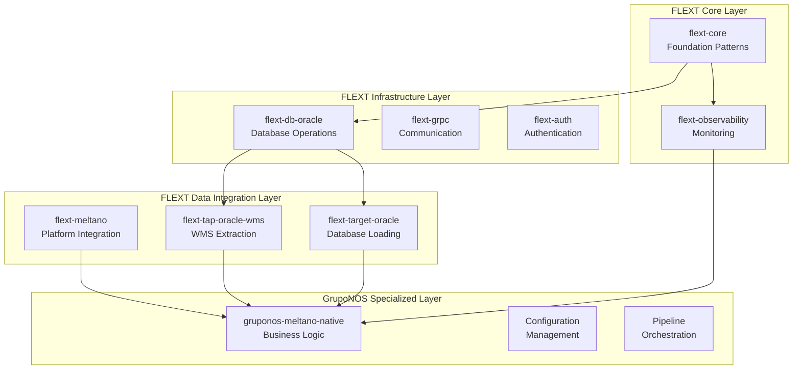

# FLEXT Framework Integration

The GrupoNOS Meltano Native project is built as a specialized implementation within the FLEXT ecosystem, leveraging core FLEXT patterns and extending them for Oracle WMS data integration.

## FLEXT Ecosystem Position



## Core FLEXT Pattern Integration

### 1. FlextResult Pattern

All operations return `FlextResult<T>` for consistent error handling:

```python
from flext_core import FlextResult
from gruponos_meltano_native.orchestrator import GruponosMeltanoOrchestrator

def execute_pipeline() -> FlextResult[PipelineResult]:
    orchestrator = GruponosMeltanoOrchestrator()

    # All FLEXT operations return FlextResult
    result = orchestrator.execute_full_sync(
        company_code="GNOS",
        facility_code="DC01"
    )

    if result.success():
        print(f"Pipeline completed: {result.value.records_processed}")
        return result
    else:
        print(f"Pipeline failed: {result.error}")
        return result.map_error(lambda e: f"Orchestration failed: {e}")
```

### 2. FLEXT Logging Integration

Structured logging following FLEXT standards:

```python
from flext_core import FlextLogger
from gruponos_meltano_native.config import GruponosMeltanoSettings

logger = FlextLogger(__name__)

class GruponosMeltanoOrchestrator:
    def __init__(self, settings: GruponosMeltanoSettings):
        self.settings = settings

    def execute_full_sync(self) -> FlextResult[PipelineResult]:
        logger.info(
            "Starting full sync",
            extra={
                "company_code": self.settings.company_code,
                "facility_code": self.settings.facility_code,
                "correlation_id": self.settings.correlation_id
            }
        )

        # Pipeline execution with structured logging
        try:
            result = self._run_meltano_pipeline()
            logger.info("Full sync completed successfully", extra={"records": result.count})
            return FlextResult[None].ok(result)
        except Exception as e:
            logger.error("Full sync failed", extra={"error": str(e)}, exc_info=True)
            return FlextResult[None].fail(f"Pipeline execution failed: {e}")
```

### 3. Dependency Injection Container

FLEXT DI container for clean dependency management:

```python
from flext_core import FlextContainer, get_flext_container
from gruponos_meltano_native.infrastructure.di_container import configure_gruponos_container

def create_gruponos_application() -> FlextContainer:
    """Create configured application container"""
    container = FlextContainer.get_global()

    # Register GrupoNOS-specific services
    configure_gruponos_container(container)

    return container

# Infrastructure configuration
def configure_gruponos_container(container: FlextContainer) -> None:
    """Configure GrupoNOS-specific dependencies"""
from gruponos_meltano_native.config import GruponosMeltanoSettings
from gruponos_meltano_native.orchestrator import GruponosMeltanoOrchestrator
from gruponos_meltano_native.oracle.connection_manager_enhanced import (
        GruponosMeltanoOracleConnectionManager
    )

    # Configuration
    container.register_singleton(GruponosMeltanoSettings)

    # Core services
    container.register_transient(GruponosMeltanoOrchestrator)
    container.register_singleton(GruponosMeltanoOracleConnectionManager)
```

## FLEXT Component Integration

### flext-core Integration

```python
# Base settings extending FLEXT patterns
from flext_core import FlextConfig

class GruponosMeltanoSettings(FlextConfig):
    """GrupoNOS Meltano configuration extending FLEXT base settings"""

    # Oracle WMS configuration
    wms_base_url: str
    wms_username: str
    wms_password: SecretStr
    company_code: str
    facility_code: str

    # Pipeline configuration
    batch_size: int = 10000
    timeout_seconds: int = 300
    enable_incremental: bool = True

    class Config:
        env_prefix = "GRUPONOS_"
        case_sensitive = False
```

### flext-observability Integration

```python
from flext_observability import (
    get_metrics_client,
    get_tracer,
    create_health_check,
    MetricsClient
)

class GruponosMeltanoMonitoring:
    def __init__(self):
        self.metrics: MetricsClient = get_metrics_client()
        self.tracer = get_tracer("gruponos-meltano-native")

    def track_pipeline_execution(self, pipeline_name: str):
        """Track pipeline execution metrics"""
        with self.tracer.start_span("pipeline_execution") as span:
            span.set_attribute("pipeline.name", pipeline_name)
            span.set_attribute("company.code", self.settings.company_code)

            # Track execution metrics
            self.metrics.counter("pipeline.executions.total").inc()
            self.metrics.histogram("pipeline.duration.seconds").observe(execution_time)

    def create_health_checks(self) -> list:
        """Create health checks for GrupoNOS pipeline"""
        return [
            create_health_check(
                name="oracle_wms_connectivity",
                check_func=self._check_wms_connection
            ),
            create_health_check(
                name="oracle_database_connectivity",
                check_func=self._check_database_connection
            ),
            create_health_check(
                name="meltano_pipeline_health",
                check_func=self._check_pipeline_health
            )
        ]
```

### flext-db-oracle Integration

```python
from flext_db_oracle import OracleConnectionManager, OracleQueryBuilder

class GruponosMeltanoOracleConnectionManager:
    def __init__(self, settings: GruponosMeltanoSettings):
        self.settings = settings
        self.connection_manager = OracleConnectionManager(
            host=settings.oracle_host,
            port=settings.oracle_port,
            service_name=settings.oracle_service_name,
            username=settings.oracle_username,
            password=settings.oracle_password.get_secret_value()
        )

    def validate_target_schema(self) -> FlextResult[bool]:
        """Validate target database schema exists"""
        query = OracleQueryBuilder().select("1").from_table("user_tables").where(
            "table_name = :table_name"
        ).build()

        with self.connection_manager.get_connection() as conn:
            result = conn.execute(query, {"table_name": "WMS_ALLOCATIONS"})
            return FlextResult[None].ok(len(result) > 0)
```

## Singer/Meltano FLEXT Integration

### flext-tap-oracle-wms Integration

```python
# Meltano configuration with FLEXT taps
# meltano.yml
plugins:
  extractors:
    - name: tap-oracle-wms-full
      namespace: tap_oracle_wms
      executable: flext-tap-oracle-wms  # FLEXT-provided tap
      config:
        base_url: $TAP_ORACLE_WMS_BASE_URL
        username: $TAP_ORACLE_WMS_USERNAME
        password: $TAP_ORACLE_WMS_PASSWORD
        company_code: $TAP_ORACLE_WMS_COMPANY_CODE
        facility_code: $TAP_ORACLE_WMS_FACILITY_CODE
        # FLEXT-specific configuration
        enable_flext_logging: true
        flext_correlation_id: true
        flext_metrics_enabled: true
```

### flext-target-oracle Integration

```python
# Target configuration with FLEXT patterns
plugins:
  loaders:
    - name: target-oracle-full
      namespace: target_oracle
      executable: flext-target-oracle  # FLEXT-provided target
      config:
        # Nested oracle_config following FLEXT patterns
        oracle_config:
          host: $FLEXT_TARGET_ORACLE_HOST
          port: $FLEXT_TARGET_ORACLE_PORT
          service_name: $FLEXT_TARGET_ORACLE_SERVICE_NAME
          username: $FLEXT_TARGET_ORACLE_USERNAME
          password: $FLEXT_TARGET_ORACLE_PASSWORD
          protocol: $FLEXT_TARGET_ORACLE_PROTOCOL
        default_target_schema: $FLEXT_TARGET_ORACLE_SCHEMA
        # FLEXT-specific features
        enable_flext_result_pattern: true
        flext_batch_processing: true
        flext_error_handling: true
```

## Exception Handling Integration

FLEXT-standardized exception patterns:

```python
from flext_core import create_module_exception_classes

# Runtime exception generation using FLEXT patterns
_exceptions = create_module_exception_classes("gruponos_meltano")

# Standard FLEXT exception hierarchy
GruponosMeltanoError = _exceptions["GruponosMeltanoError"]
GruponosMeltanoValidationError = _exceptions["GruponosMeltanoValidationError"]
GruponosMeltanoConnectionError = _exceptions["GruponosMeltanoConnectionError"]
GruponosMeltanoProcessingError = _exceptions["GruponosMeltanoProcessingError"]

# Usage in business logic
def validate_wms_data(data: dict) -> FlextResult[ValidatedData]:
    try:
        # Validation logic
        validated = perform_validation(data)
        return FlextResult[None].ok(validated)
    except ValidationError as e:
        raise GruponosMeltanoValidationError(f"WMS data validation failed: {e}")
    except ConnectionError as e:
        raise GruponosMeltanoConnectionError(f"Oracle WMS connection failed: {e}")
```

## Configuration Management Integration

FLEXT configuration patterns with environment-specific overrides:

```python
from flext_core import FlextConfig
from pydantic import Field, SecretStr

class GruponosMeltanoSettings(FlextConfig):
    """FLEXT-standardized configuration management"""

    # FLEXT core settings inherited
    environment: str = Field(default="dev", env="FLEXT_ENVIRONMENT")
    log_level: str = Field(default="INFO", env="FLEXT_LOG_LEVEL")

    # GrupoNOS-specific settings
    wms_base_url: str = Field(..., env="TAP_ORACLE_WMS_BASE_URL")
    wms_username: str = Field(..., env="TAP_ORACLE_WMS_USERNAME")
    wms_password: SecretStr = Field(..., env="TAP_ORACLE_WMS_PASSWORD")

    # Oracle target settings
    oracle_host: str = Field(..., env="FLEXT_TARGET_ORACLE_HOST")
    oracle_service_name: str = Field(..., env="FLEXT_TARGET_ORACLE_SERVICE_NAME")

    class Config:
        env_prefix = "GRUPONOS_"
        case_sensitive = False
        # FLEXT configuration standards
        validate_assignment = True
        use_enum_values = True
```

## Benefits of FLEXT Integration

### 1. Consistency Across Ecosystem

- Standardized error handling with FlextResult
- Consistent logging and monitoring patterns
- Unified configuration management

### 2. Enterprise Features

- Built-in observability and metrics
- Comprehensive health checks
- Production-ready patterns

### 3. Maintainability

- Shared patterns reduce code duplication
- Standardized interfaces improve testability
- Clear separation of concerns

### 4. Scalability

- Proven patterns for enterprise environments
- Built-in performance monitoring
- Horizontal scaling capabilities

---

**Next**: [Clean Architecture](clean-architecture.md) | [Data Pipeline Design](data-pipeline.md)
