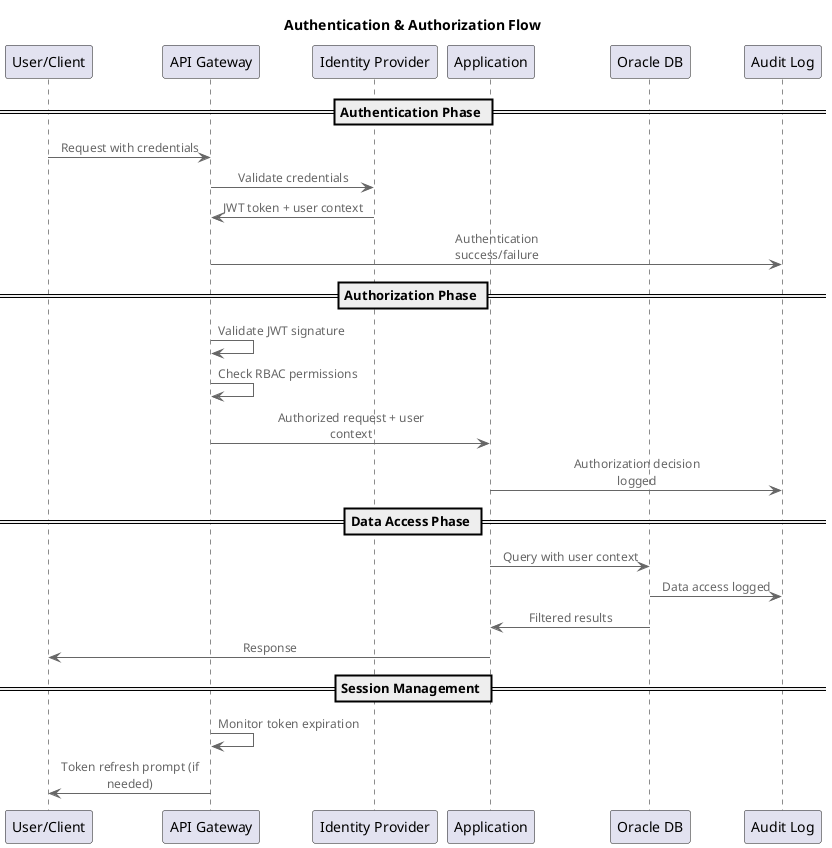
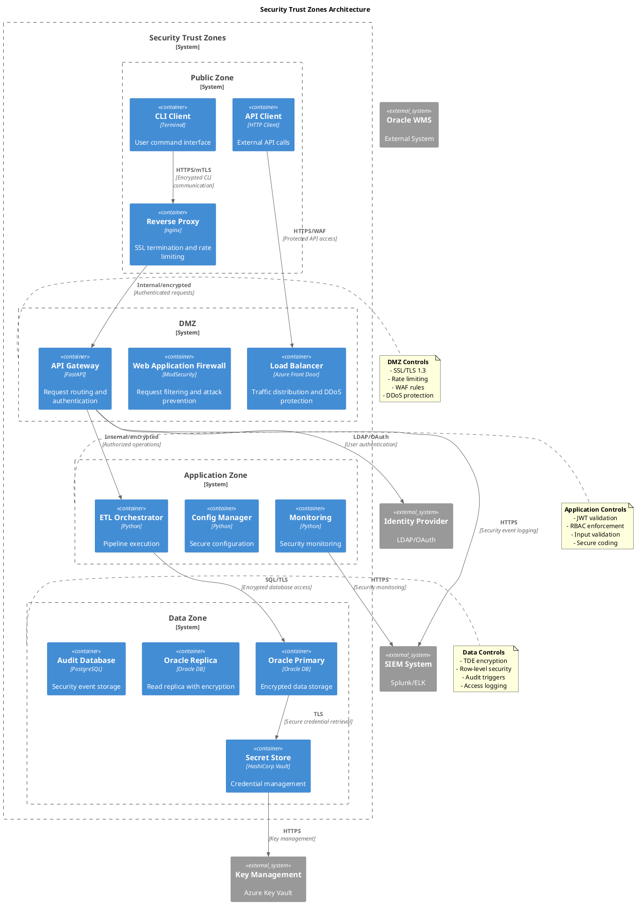
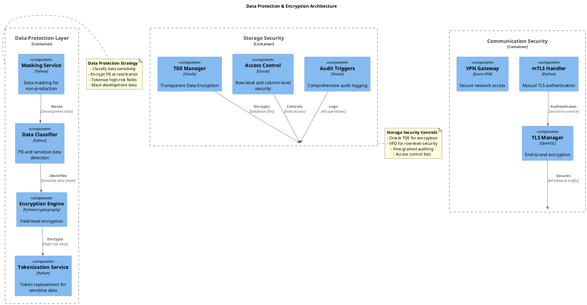
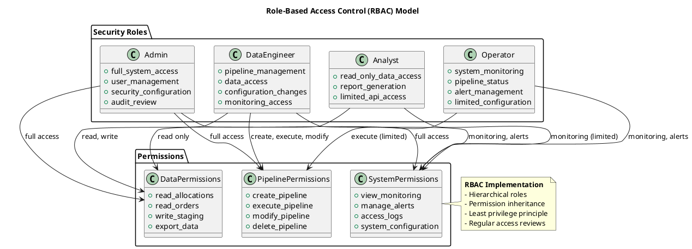
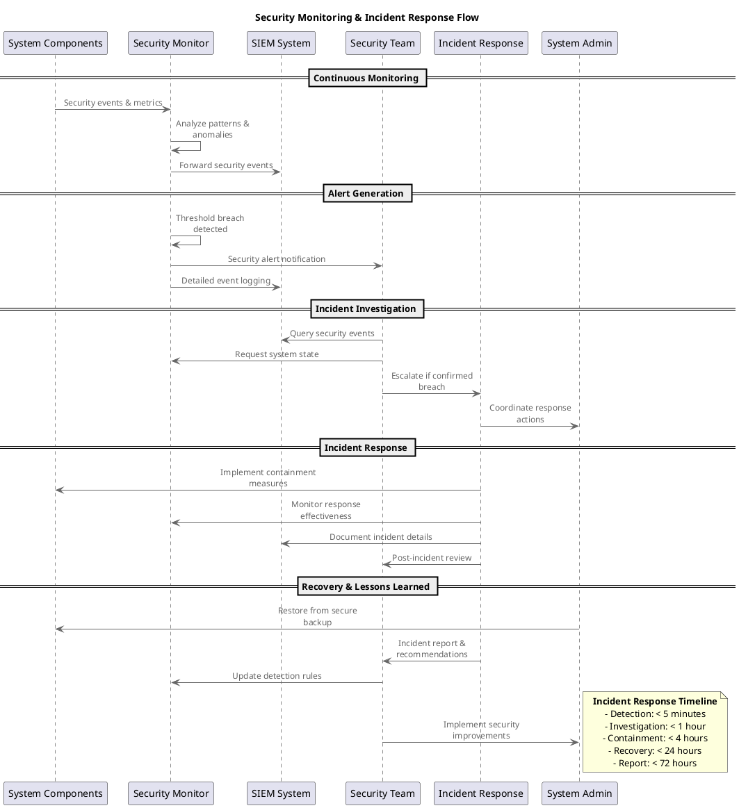
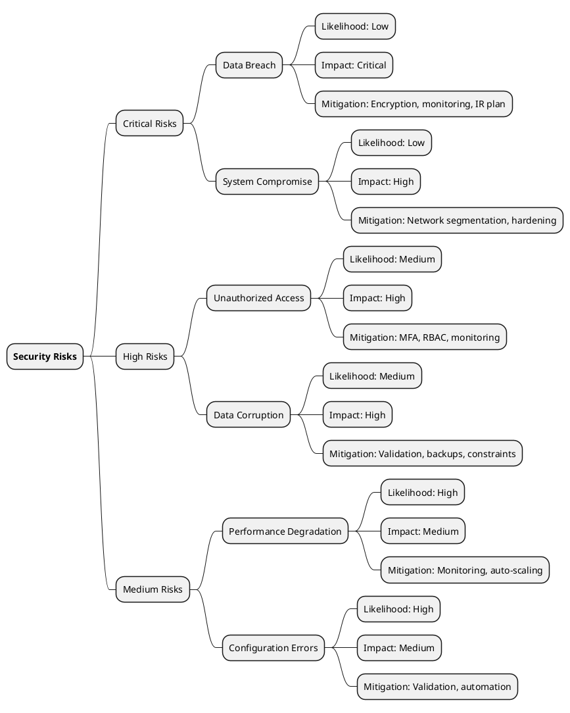

# Security Architecture Documentation

## Table of Contents

- Security Architecture Documentation
  - 📋 Security Architecture Overview
    - Security Principles
    - Security Objectives
  - 🛡️ Security Architecture Components
    - Authentication & Authorization
    - Trust Zones & Network Security
    - Data Protection Architecture
  - 🔐 Security Controls Implementation
    - Authentication Methods
    - Authorization Model
    - Security Monitoring & Incident Response
  - 📊 Security Metrics & Compliance
    - Security KPIs
    - Compliance Requirements
      - GDPR Compliance
      - ISO 27001 Compliance
    - Security Testing & Validation
      - Automated Security Testing
- Security test suite execution
      - Security Test Categories
  - 🚨 Threat Model & Risk Assessment
    - Primary Threats
    - Attack Vectors & Controls
    - Risk Assessment Matrix
  - 🔧 Security Implementation Details
    - Secure Configuration Management
- Secure configuration patterns
  - Secure Coding Practices
- Railway pattern with security validation
  - Security Monitoring Integration
- Security event logging
  - 📋 Security Operations Procedures
    - Daily Security Operations
    - Weekly Security Operations
    - Monthly Security Operations
    - Incident Response Plan
      - Phase 1: Detection & Assessment (0-15 minutes)
      - Phase 2: Containment (15-60 minutes)
      - Phase 3: Eradication (1-4 hours)
      - Phase 4: Recovery (4-24 hours)
      - Phase 5: Lessons Learned (24-72 hours)
  - 🎯 Security Quality Attributes
    - Confidentiality
    - Integrity
    - Availability
    - Non-Repudiation
  - 🔄 Security Evolution & Roadmap
    - Current Security Maturity Level: **Advanced**
    - Security Roadmap
      - Q1 2026: Enhanced Threat Detection
      - Q2 2026: Zero Trust Implementation
      - Q3 2026: Compliance Automation
      - Q4 2026: Security Operations Center


**Project**: gruponos-meltano-native | **Version**: 0.9.0 | **Status**: Production Security Implementation
**Framework**: Zero Trust Architecture | **Last Updated**: 2025-10-10

---

## 📋 Security Architecture Overview

The gruponos-meltano-native system implements a comprehensive security architecture based on zero trust principles,
     ensuring end-to-end security for enterprise ETL operations with Oracle WMS integration.

### Security Principles

- **Zero Trust**: Never trust, always verify
- **Defense in Depth**: Multiple security layers
- **Least Privilege**: Minimum required access
- **Fail-Safe Defaults**: Secure by default configuration
- **Audit Everything**: Comprehensive logging and monitoring

### Security Objectives

- **Confidentiality**: Protect sensitive warehouse and customer data
- **Integrity**: Ensure data accuracy and prevent unauthorized modifications
- **Availability**: Maintain 99.5% uptime with secure recovery capabilities
- **Compliance**: Meet GDPR, ISO 27001, and enterprise security standards

---

## 🛡️ Security Architecture Components

### Authentication & Authorization



### Trust Zones & Network Security



### Data Protection Architecture



---

## 🔐 Security Controls Implementation

### Authentication Methods

Method: **JWT Tokens** - Use Case: API authentication - Implementation: RS256 signatures, 15min expiry - Strength: High
Method: **OAuth2** - Use Case: External integrations - Implementation: Authorization code flow - Strength: High
Method: **mTLS** - Use Case: Service-to-service - Implementation: Client certificates - Strength: Very High
Method: **API Keys** - Use Case: Service accounts - Implementation: HMAC signatures - Strength: Medium

### Authorization Model



### Security Monitoring & Incident Response



---

## 📊 Security Metrics & Compliance

### Security KPIs

Metric: **Mean Time to Detect (MTTD)** - Target: < 5 minutes - Current: < 3 minutes - Status: ✅ Excellent
Metric: **Mean Time to Respond (MTTR)** - Target: < 1 hour - Current: < 30 minutes - Status: ✅ Excellent
Metric: **Security Incident Rate** - Target: < 1/month - Current: 0.2/month - Status: ✅ Good
Metric: **Compliance Audit Score** - Target: 100% - Current: 98% - Status: 🟡 Minor gaps
Metric: **Data Breach Prevention** - Target: 100% - Current: 100% - Status: ✅ Perfect

### Compliance Requirements

#### GDPR Compliance

- **Data Protection**: End-to-end encryption for PII
- **Access Controls**: Strict RBAC with audit trails
- **Data Minimization**: Only necessary data collection
- **Breach Notification**: < 72 hours automated alerts
- **Right to Erasure**: Data deletion capabilities

#### ISO 27001 Compliance

- **Risk Management**: Continuous risk assessment
- **Access Control**: Multi-factor authentication
- **Cryptography**: Industry-standard encryption
- **Physical Security**: Cloud provider security
- **Incident Management**: Formal IR procedures

### Security Testing & Validation

#### Automated Security Testing

```bash
# Security test suite execution
make security-test              # SAST, DAST, dependency scanning
make compliance-check          # GDPR, ISO 27001 validation
make vulnerability-scan        # Container and dependency scanning
make penetration-test          # Automated security testing
```

#### Security Test Categories

Test Type: **SAST** - Frequency: Every commit - Tools: Bandit, Semgrep - Coverage: Code security
Test Type: **DAST** - Frequency: Daily - Tools: OWASP ZAP - Coverage: Runtime security
Test Type: **Dependency Scan** - Frequency: Weekly - Tools: Snyk, Dependabot - Coverage: Third-party risks
Test Type: **Container Scan** - Frequency: Every build - Tools: Trivy, Clair - Coverage: Image vulnerabilities
Test Type: **Compliance Audit** - Frequency: Monthly - Tools: Custom scripts - Coverage: Regulatory requirements
---

## 🚨 Threat Model & Risk Assessment

### Primary Threats

Threat: **Unauthorized Data Access** - Likelihood: Medium - Impact: High - Mitigation: RBAC, encryption, audit logging
Threat: **Data Exfiltration** - Likelihood: Low - Impact: Critical - Mitigation: DLP, network controls, monitoring
Threat: **API Abuse** - Likelihood: High - Impact: Medium - Mitigation: Rate limiting, WAF, authentication
Threat: **Supply Chain Attack** - Likelihood: Low - Impact: Critical - Mitigation: SBOM, signature verification
Threat: **Insider Threat** - Likelihood: Low - Impact: High - Mitigation: Access monitoring, job rotation

### Attack Vectors & Controls

```plantuml
@startuml Attack_Vectors_Matrix
title Attack Vectors & Security Controls Matrix

skinparam backgroundColor #FEFEFE
skinparam backgroundColor<<Risk>> #FFAAAA

Attack Vector: <b>XSS Attacks</b> - Likelihood: Medium - Impact: Medium - Current Controls: Input sanitization, CSP - Gap Analysis: ✅ Covered
Attack Vector: <b>API Abuse</b> - Likelihood: High - Impact: Medium - Current Controls: Rate limiting, JWT validation - Gap Analysis: ⚠️ Monitor closely
Attack Vector: <b>Data Leakage</b> - Likelihood: Medium - Impact: Critical - Current Controls: Encryption, access controls - Gap Analysis: ✅ Covered
Attack Vector: <b>DDoS Attacks</b> - Likelihood: Low - Impact: High - Current Controls: Azure Front Door, rate limiting - Gap Analysis: ✅ Covered
Attack Vector: <b>Credential Stuffing</b> - Likelihood: Medium - Impact: High - Current Controls: MFA, account lockout - Gap Analysis: ✅ Covered
Attack Vector: <b>Supply Chain</b> - Likelihood: Low - Impact: Critical - Current Controls: Code signing, SBOM - Gap Analysis: 🟡 Partial coverage@enduml
```

### Risk Assessment Matrix



---

## 🔧 Security Implementation Details

### Secure Configuration Management

```python
# Secure configuration patterns
from pydantic import BaseModel, Field, SecretStr
from typing import Optional

class SecurityConfig(BaseModel):
    """Security configuration with validation."""

    # Authentication
    jwt_secret: SecretStr = Field(..., min_length=32)
    jwt_algorithm: str = Field(default="RS256")
    jwt_expiry_minutes: int = Field(default=15, ge=5, le=60)

    # Encryption
    encryption_key: SecretStr = Field(..., min_length=16)
    encryption_algorithm: str = Field(default="AES-256-GCM")

    # Database security
    db_ssl_mode: str = Field(default="require")
    db_ssl_cert: Optional[str] = None

    # API security
    api_rate_limit: int = Field(default=100, ge=10)
    api_timeout_seconds: int = Field(default=30, ge=10, le=300)

    # Audit settings
    audit_enabled: bool = Field(default=True)
    audit_retention_days: int = Field(default=2555, ge=365)  # 7 years for GDPR

    class Config:
        env_prefix = "SECURITY_"
        validate_assignment = True
```

### Secure Coding Practices

```python
# Railway pattern with security validation
from flext_core import FlextResult
from typing import Dict, Any

def secure_data_operation(data: Dict[str, Any]) -> FlextResult[Dict[str, Any]]:
    """Secure data operation with validation and audit."""

    return (
        validate_input_data(data)
        .flat_map(check_access_permissions)
        .flat_map(apply_security_filters)
        .flat_map(encrypt_sensitive_fields)
        .map(log_security_event)
        .map_error(handle_security_error)
    )

def validate_input_data(data: Dict[str, Any]) -> FlextResult[Dict[str, Any]]:
    """Validate input data for security issues."""
    # Check for SQL injection patterns
    # Validate data types and ranges
    # Check for malicious content
    pass

def check_access_permissions(data: Dict[str, Any]) -> FlextResult[Dict[str, Any]]:
    """Verify user has access to requested data."""
    # Check RBAC permissions
    # Validate data ownership
    # Apply row-level security
    pass
```

### Security Monitoring Integration

```python
# Security event logging
import structlog
from typing import Dict, Any

class SecurityLogger:
    """Centralized security event logging."""

    @staticmethod
    def log_authentication_event(user_id: str, success: bool, details: Dict[str, Any]):
        """Log authentication events."""
        structlog.get_logger().info(
            "authentication_attempt",
            user_id=user_id,
            success=success,
            event_type="authentication",
            severity="INFO" if success else "WARNING",
            **details
        )

    @staticmethod
    def log_data_access_event(user_id: str, resource: str, action: str, success: bool):
        """Log data access events for audit trails."""
        structlog.get_logger().info(
            "data_access",
            user_id=user_id,
            resource=resource,
            action=action,
            success=success,
            event_type="data_access",
            severity="INFO",
            compliance="GDPR_AUDIT"
        )

    @staticmethod
    def log_security_incident(incident_type: str, severity: str, details: Dict[str, Any]):
        """Log security incidents."""
        structlog.get_logger().error(
            "security_incident",
            incident_type=incident_type,
            severity=severity,
            event_type="security_incident",
            **details
        )
```

---

## 📋 Security Operations Procedures

### Daily Security Operations

1. **Security Log Review**: Automated analysis of security events
2. **Vulnerability Scanning**: Container and dependency vulnerability checks
3. **Access Review**: Automated review of recent access patterns
4. **Compliance Monitoring**: Continuous compliance status validation

### Weekly Security Operations

1. **Threat Intelligence Review**: Analysis of emerging threats
2. **Security Metrics Review**: KPI and trend analysis
3. **Configuration Audit**: Security configuration validation
4. **Team Training**: Security awareness updates

### Monthly Security Operations

1. **Comprehensive Security Audit**: Full system security assessment
2. **Compliance Review**: Regulatory compliance validation
3. **Incident Response Drill**: Security incident simulation
4. **Security Roadmap Review**: Future security improvements

### Incident Response Plan

#### Phase 1: Detection & Assessment (0-15 minutes)

- Automated alerting triggers incident response
- Security team assesses incident severity and scope
- Initial containment measures implemented

#### Phase 2: Containment (15-60 minutes)

- Affected systems isolated
- Evidence preservation initiated
- Communication plan activated

#### Phase 3: Eradication (1-4 hours)

- Root cause analysis performed
- Malicious activity removed
- System hardening implemented

#### Phase 4: Recovery (4-24 hours)

- Systems restored from clean backups
- Security monitoring validated
- Service continuity confirmed

#### Phase 5: Lessons Learned (24-72 hours)

- Incident report completed
- Process improvements identified
- Team debriefing conducted

---

## 🎯 Security Quality Attributes

### Confidentiality

- **Data Classification**: PII, sensitive, public data categories
- **Encryption Standards**: AES-256 for data at rest, TLS 1.3 for transit
- **Access Controls**: Need-to-know basis with audit trails
- **Data Masking**: Automated masking for non-production environments

### Integrity

- **Input Validation**: Comprehensive input sanitization and validation
- **Business Rules**: Automated validation of business logic constraints
- **Audit Trails**: Immutable audit logs for all data modifications
- **Checksum Validation**: Data integrity verification during transfer

### Availability

- **Redundancy**: Multi-zone deployment with automatic failover
- **Load Balancing**: Distributed traffic with health monitoring
- **Rate Limiting**: DDoS protection and abuse prevention
- **Circuit Breakers**: Automatic degradation under load

### Non-Repudiation

- **Digital Signatures**: Cryptographic proof of data origin
- **Timestamping**: Trusted timestamps for all transactions
- **Audit Logging**: Comprehensive activity logging
- **Legal Compliance**: Evidence collection for regulatory requirements

---

## 🔄 Security Evolution & Roadmap

### Current Security Maturity Level: **Advanced**

Dimension: **Technology** - Current Level: Advanced - Target Level: Leading - Timeline: 6-12 months
Dimension: **Processes** - Current Level: Mature - Target Level: Optimized - Timeline: 3-6 months
Dimension: **People** - Current Level: Trained - Target Level: Expert - Timeline: Ongoing
Dimension: **Compliance** - Current Level: Compliant - Target Level: Proactive - Timeline: 3-6 months

### Security Roadmap

#### Q1 2026: Enhanced Threat Detection

- AI-powered anomaly detection
- Advanced behavioral analytics
- Automated threat hunting
- Integration with threat intelligence feeds

#### Q2 2026: Zero Trust Implementation

- Complete micro-segmentation
- Service mesh security
- Device trust validation
- Continuous authentication

#### Q3 2026: Compliance Automation

- Automated compliance monitoring
- Continuous compliance validation
- Regulatory reporting automation
- Audit trail analytics

#### Q4 2026: Security Operations Center

- 24/7 SOC operations
- Advanced SIEM integration
- Automated incident response
- Threat intelligence platform

---

**Security Architecture Documentation** - Comprehensive security implementation following zero trust principles with enterprise-grade controls,

     compliance frameworks,
     and operational procedures for the gruponos-meltano-native ETL pipeline system.
