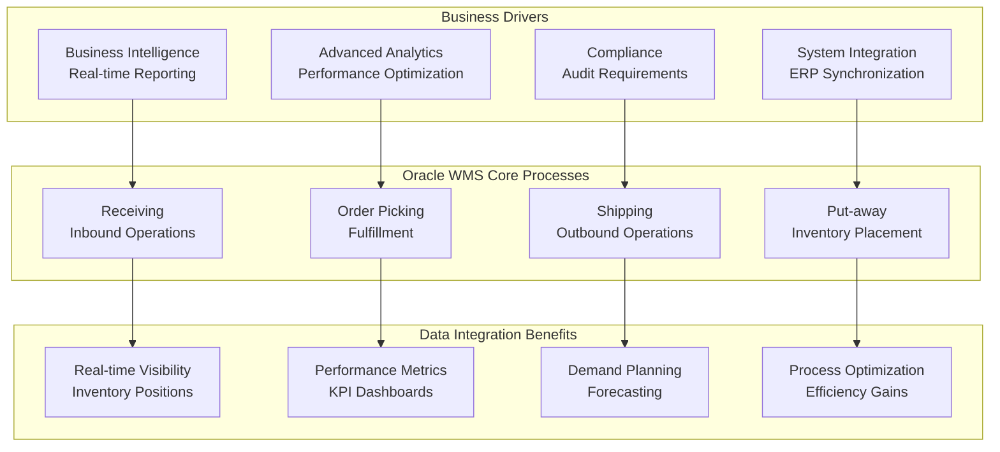
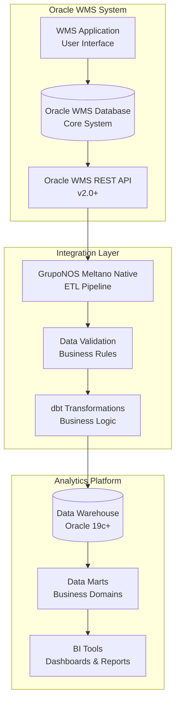

# Oracle WMS Integration

**Oracle Warehouse Management System Integration** - Business context, data models, and integration patterns for GrupoNOS Oracle WMS environment.

## Business Overview

GrupoNOS operates a sophisticated Oracle Warehouse Management System (WMS) that manages inventory, order fulfillment, and warehouse operations across multiple facilities. This integration provides real-time data synchronization for business intelligence, reporting, and analytics.

### Business Objectives



### Key Performance Indicators (KPIs)

#### Operational KPIs

- **Order Fulfillment Rate**: Percentage of orders completely fulfilled
- **Pick Accuracy**: Accuracy of picking operations
- **Inventory Turnover**: Rate of inventory movement
- **Throughput**: Items processed per hour/day
- **Space Utilization**: Warehouse space efficiency

#### Integration KPIs

- **Data Freshness**: Time lag between WMS and analytics data
- **Sync Success Rate**: Percentage of successful data synchronizations
- **Data Quality Score**: Accuracy and completeness of synchronized data
- **Processing Time**: ETL pipeline execution duration

---

## Oracle WMS Data Architecture

### System Architecture Overview



### Core Business Entities

#### 1. Allocation Entity

Represents warehouse allocation and picking operations.

```python
class WMSAllocation(BaseModel):
    """Oracle WMS allocation business entity"""

    # Primary identifiers
    allocation_id: str = Field(..., description="Unique allocation identifier")
    company_code: str = Field(..., description="GrupoNOS company code")
    facility_code: str = Field(..., description="Warehouse facility code")

    # Order references
    order_dtl_id: str = Field(..., description="Order detail line reference")
    order_hdr_id: str = Field(..., description="Order header reference")

    # Item and location information
    item_code: str = Field(..., description="Product/SKU identifier")
    item_description: Optional[str] = Field(None, description="Product description")
    location: str = Field(..., description="Warehouse location code")
    zone: Optional[str] = Field(None, description="Warehouse zone")

    # Quantity information
    allocated_quantity: int = Field(..., ge=0, description="Quantity allocated for picking")
    packed_quantity: Optional[int] = Field(None, ge=0, description="Quantity actually packed")
    picked_quantity: Optional[int] = Field(None, ge=0, description="Quantity picked")

    # Status tracking
    allocation_status: AllocationStatus = Field(..., description="Current allocation status")
    pick_status: Optional[PickStatus] = Field(None, description="Picking status")

    # Timestamps (Oracle WMS timestamps)
    created_timestamp: datetime = Field(..., description="Allocation creation time")
    modified_timestamp: datetime = Field(..., description="Last modification time")
    pick_start_time: Optional[datetime] = Field(None, description="Pick task start time")
    pick_complete_time: Optional[datetime] = Field(None, description="Pick task completion time")

    # Audit fields
    created_by: str = Field(..., description="User who created allocation")
    modified_by: str = Field(..., description="User who last modified allocation")

    # Business metrics (calculated fields)
    fulfillment_rate: Optional[float] = Field(None, description="Packed/Allocated ratio")
    processing_time_minutes: Optional[int] = Field(None, description="Pick processing time")

class AllocationStatus(str, Enum):
    """Allocation status enumeration"""
    PENDING = "PENDING"
    ALLOCATED = "ALLOCATED"
    PICKED = "PICKED"
    PACKED = "PACKED"
    SHIPPED = "SHIPPED"
    CANCELLED = "CANCELLED"

class PickStatus(str, Enum):
    """Pick status enumeration"""
    NOT_STARTED = "NOT_STARTED"
    IN_PROGRESS = "IN_PROGRESS"
    COMPLETED = "COMPLETED"
    SHORT_PICKED = "SHORT_PICKED"
    CANCELLED = "CANCELLED"
```

#### 2. Order Header Entity

Master order information and customer details.

```python
class WMSOrderHeader(BaseModel):
    """Oracle WMS order header business entity"""

    # Primary identifiers
    order_hdr_id: str = Field(..., description="Unique order identifier")
    order_number: str = Field(..., description="Business order number")
    company_code: str = Field(..., description="GrupoNOS company code")
    facility_code: str = Field(..., description="Fulfillment facility")

    # Customer information
    customer_id: str = Field(..., description="Customer identifier")
    customer_name: Optional[str] = Field(None, description="Customer name")
    customer_type: Optional[CustomerType] = Field(None, description="Customer classification")

    # Order classification
    order_type: OrderType = Field(..., description="Type of order")
    order_priority: OrderPriority = Field(default=OrderPriority.NORMAL, description="Order priority")

    # Shipping information
    ship_to_address: Optional[Address] = Field(None, description="Shipping address")
    carrier: Optional[str] = Field(None, description="Shipping carrier")
    service_level: Optional[str] = Field(None, description="Service level agreement")

    # Dates and timing
    order_date: datetime = Field(..., description="Order placement date")
    requested_ship_date: Optional[date] = Field(None, description="Requested ship date")
    promised_delivery_date: Optional[date] = Field(None, description="Promised delivery date")
    actual_ship_date: Optional[date] = Field(None, description="Actual shipping date")

    # Status tracking
    order_status: OrderStatus = Field(..., description="Current order status")
    fulfillment_status: Optional[FulfillmentStatus] = Field(None, description="Fulfillment progress")

    # Financial information
    order_value: Optional[Decimal] = Field(None, ge=0, description="Total order value")
    currency: str = Field(default="BRL", description="Order currency")

    # Operational metrics
    total_items: Optional[int] = Field(None, ge=0, description="Total item count")
    total_lines: Optional[int] = Field(None, ge=0, description="Total order lines")
    total_quantity: Optional[int] = Field(None, ge=0, description="Total quantity ordered")

    # Timestamps
    created_timestamp: datetime = Field(..., description="Record creation time")
    modified_timestamp: datetime = Field(..., description="Last modification time")

    # Audit fields
    created_by: str = Field(..., description="User who created order")
    modified_by: str = Field(..., description="User who last modified order")

class OrderType(str, Enum):
    """Order type classification"""
    SALES = "SALES"
    TRANSFER = "TRANSFER"
    RETURN = "RETURN"
    REPLENISHMENT = "REPLENISHMENT"
    CYCLE_COUNT = "CYCLE_COUNT"

class OrderPriority(str, Enum):
    """Order priority levels"""
    LOW = "LOW"
    NORMAL = "NORMAL"
    HIGH = "HIGH"
    URGENT = "URGENT"
    EMERGENCY = "EMERGENCY"

class OrderStatus(str, Enum):
    """Order status enumeration"""
    NEW = "NEW"
    CONFIRMED = "CONFIRMED"
    PLANNING = "PLANNING"
    ALLOCATED = "ALLOCATED"
    PICKED = "PICKED"
    PACKED = "PACKED"
    SHIPPED = "SHIPPED"
    DELIVERED = "DELIVERED"
    CANCELLED = "CANCELLED"
    ON_HOLD = "ON_HOLD"

class FulfillmentStatus(str, Enum):
    """Order fulfillment status"""
    NOT_STARTED = "NOT_STARTED"
    IN_PROGRESS = "IN_PROGRESS"
    PARTIALLY_FULFILLED = "PARTIALLY_FULFILLED"
    FULLY_FULFILLED = "FULLY_FULFILLED"
    CANCELLED = "CANCELLED"
```

#### 3. Order Detail Entity

Individual order line items and product specifications.

```python
class WMSOrderDetail(BaseModel):
    """Oracle WMS order detail business entity"""

    # Primary identifiers
    order_dtl_id: str = Field(..., description="Unique order detail identifier")
    order_hdr_id: str = Field(..., description="Parent order header reference")
    line_number: int = Field(..., ge=1, description="Order line sequence number")

    # Product information
    item_code: str = Field(..., description="Product/SKU identifier")
    item_description: Optional[str] = Field(None, description="Product description")
    item_category: Optional[str] = Field(None, description="Product category")
    item_class: Optional[str] = Field(None, description="Product classification")

    # Quantity and unit information
    ordered_quantity: int = Field(..., ge=0, description="Quantity ordered")
    allocated_quantity: Optional[int] = Field(None, ge=0, description="Quantity allocated")
    picked_quantity: Optional[int] = Field(None, ge=0, description="Quantity picked")
    packed_quantity: Optional[int] = Field(None, ge=0, description="Quantity packed")
    shipped_quantity: Optional[int] = Field(None, ge=0, description="Quantity shipped")

    # Unit information
    unit_of_measure: str = Field(..., description="Unit of measure")
    pack_size: Optional[int] = Field(None, ge=1, description="Items per pack")

    # Pricing information
    unit_price: Optional[Decimal] = Field(None, ge=0, description="Unit price")
    extended_price: Optional[Decimal] = Field(None, ge=0, description="Line total price")
    discount_amount: Optional[Decimal] = Field(None, ge=0, description="Discount applied")

    # Inventory attributes
    lot_number: Optional[str] = Field(None, description="Lot/batch number")
    serial_number: Optional[str] = Field(None, description="Serial number")
    expiration_date: Optional[date] = Field(None, description="Product expiration date")

    # Status tracking
    line_status: LineStatus = Field(..., description="Order line status")
    allocation_status: Optional[AllocationStatus] = Field(None, description="Allocation status")

    # Special handling
    special_instructions: Optional[str] = Field(None, description="Special handling instructions")
    hazmat_flag: bool = Field(default=False, description="Hazardous material indicator")
    fragile_flag: bool = Field(default=False, description="Fragile item indicator")

    # Dates
    requested_date: Optional[date] = Field(None, description="Requested availability date")
    promised_date: Optional[date] = Field(None, description="Promised ship date")

    # Timestamps
    created_timestamp: datetime = Field(..., description="Record creation time")
    modified_timestamp: datetime = Field(..., description="Last modification time")

    # Audit fields
    created_by: str = Field(..., description="User who created line")
    modified_by: str = Field(..., description="User who last modified line")

    # Business metrics (calculated fields)
    fulfillment_rate: Optional[float] = Field(None, description="Shipped/Ordered ratio")
    allocation_efficiency: Optional[float] = Field(None, description="Allocated/Ordered ratio")

class LineStatus(str, Enum):
    """Order line status enumeration"""
    OPEN = "OPEN"
    ALLOCATED = "ALLOCATED"
    PICKED = "PICKED"
    PACKED = "PACKED"
    SHIPPED = "SHIPPED"
    CANCELLED = "CANCELLED"
    BACK_ORDERED = "BACK_ORDERED"
    SHORT_SHIPPED = "SHORT_SHIPPED"
```

---

## Oracle WMS API Integration

### API Endpoint Structure

```python
class OracleWMSAPIClient:
    """Oracle WMS REST API client for data extraction"""

    def __init__(self, base_url: str, username: str, password: str):
        self.base_url = base_url
        self.session = self._create_authenticated_session(username, password)

    def get_allocations(
        self,
        company_code: str,
        facility_code: str,
        since_timestamp: Optional[datetime] = None,
        page_size: int = 500,
        page_number: int = 1
    ) -> FlextTypes.Dict:
        """Get allocation data from Oracle WMS

        Args:
            company_code: GrupoNOS company identifier
            facility_code: Warehouse facility code
            since_timestamp: Get records modified since timestamp (incremental)
            page_size: Number of records per page (max 1000)
            page_number: Page number for pagination

        Returns:
            API response with allocation data and pagination info
        """
        params = {
            "company_code": company_code,
            "facility_code": facility_code,
            "page_size": page_size,
            "page_number": page_number
        }

        if since_timestamp:
            params["modified_since"] = since_timestamp.isoformat()

        endpoint = f"{self.base_url}/allocations"
        response = self.session.get(endpoint, params=params)
        return response.json()

    def get_order_headers(
        self,
        company_code: str,
        facility_code: str,
        since_timestamp: Optional[datetime] = None,
        order_status: Optional[List[str]] = None,
        page_size: int = 500
    ) -> FlextTypes.Dict:
        """Get order header data from Oracle WMS"""

    def get_order_details(
        self,
        company_code: str,
        facility_code: str,
        order_hdr_ids: Optional[List[str]] = None,
        since_timestamp: Optional[datetime] = None,
        page_size: int = 500
    ) -> FlextTypes.Dict:
        """Get order detail data from Oracle WMS"""
```

### API Response Format

```json
{
  "status": "success",
  "message": "Data retrieved successfully",
  "pagination": {
    "current_page": 1,
    "total_pages": 150,
    "page_size": 500,
    "total_records": 75000,
    "has_next_page": true
  },
  "data": [
    {
      "allocation_id": "ALLOC-2025-001234",
      "company_code": "GNOS",
      "facility_code": "DC01",
      "order_dtl_id": "ODT-2025-567890",
      "order_hdr_id": "ORD-2025-123456",
      "item_code": "SKU-ABC-001",
      "item_description": "Product ABC Description",
      "location": "A-01-02-03",
      "zone": "PICK-A",
      "allocated_quantity": 10,
      "packed_quantity": 10,
      "picked_quantity": 10,
      "allocation_status": "PACKED",
      "pick_status": "COMPLETED",
      "created_timestamp": "2025-08-04T10:30:00Z",
      "modified_timestamp": "2025-08-04T14:45:00Z",
      "pick_start_time": "2025-08-04T13:00:00Z",
      "pick_complete_time": "2025-08-04T13:15:00Z",
      "created_by": "WMS_USER_001",
      "modified_by": "WMS_USER_002",
      "fulfillment_rate": 1.0,
      "processing_time_minutes": 15
    }
  ],
  "metadata": {
    "extraction_timestamp": "2025-08-04T15:00:00Z",
    "api_version": "v2.1",
    "response_time_ms": 250
  }
}
```

---

## Business Rules and Validation

### Data Quality Rules

```python
class WMSDataValidator:
    """Business rule validation for Oracle WMS data"""

    def validate_allocation_business_rules(
        self,
        allocation: WMSAllocation
    ) -> ValidationResult:
        """Validate allocation against business rules"""

        errors = []

        # Rule 1: Allocation quantity must be positive
        if allocation.allocated_quantity <= 0:
            errors.append(ValidationError(
                record_id=allocation.allocation_id,
                field_name="allocated_quantity",
                error_type="BUSINESS_RULE_VIOLATION",
                error_message="Allocated quantity must be greater than zero",
                actual_value=allocation.allocated_quantity
            ))

        # Rule 2: Packed quantity cannot exceed allocated quantity
        if (allocation.packed_quantity and
            allocation.packed_quantity > allocation.allocated_quantity):
            errors.append(ValidationError(
                record_id=allocation.allocation_id,
                field_name="packed_quantity",
                error_type="BUSINESS_RULE_VIOLATION",
                error_message="Packed quantity cannot exceed allocated quantity",
                actual_value=allocation.packed_quantity,
                expected_value=f"<= {allocation.allocated_quantity}"
            ))

        # Rule 3: Status progression validation
        if not self._validate_status_progression(allocation):
            errors.append(ValidationError(
                record_id=allocation.allocation_id,
                field_name="allocation_status",
                error_type="STATUS_PROGRESSION_ERROR",
                error_message="Invalid status progression",
                actual_value=allocation.allocation_status
            ))

        # Rule 4: Facility-specific validations
        facility_errors = self._validate_facility_rules(allocation)
        errors.extend(facility_errors)

        return ValidationResult(
            entity_name="allocation",
            total_records=1,
            valid_records=1 if not errors else 0,
            invalid_records=1 if errors else 0,
            validation_errors=errors,
            quality_score=0.0 if errors else 1.0,
            passed_validation=len(errors) == 0
        )

    def _validate_status_progression(self, allocation: WMSAllocation) -> bool:
        """Validate allocation status progression logic"""

        valid_progressions = {
            AllocationStatus.PENDING: [AllocationStatus.ALLOCATED, AllocationStatus.CANCELLED],
            AllocationStatus.ALLOCATED: [AllocationStatus.PICKED, AllocationStatus.CANCELLED],
            AllocationStatus.PICKED: [AllocationStatus.PACKED, AllocationStatus.CANCELLED],
            AllocationStatus.PACKED: [AllocationStatus.SHIPPED, AllocationStatus.CANCELLED],
            AllocationStatus.SHIPPED: [],  # Terminal status
            AllocationStatus.CANCELLED: []  # Terminal status
        }

        # Additional validation logic for status progression
        if allocation.allocation_status == AllocationStatus.PACKED:
            return allocation.packed_quantity and allocation.packed_quantity > 0

        if allocation.allocation_status == AllocationStatus.PICKED:
            return allocation.picked_quantity and allocation.picked_quantity > 0

        return True

    def _validate_facility_rules(
        self,
        allocation: WMSAllocation
    ) -> List[ValidationError]:
        """Validate facility-specific business rules"""

        errors = []

        # GrupoNOS facility-specific rules
        if allocation.facility_code == "DC01":
            # DC01 specific rules
            if not allocation.location.startswith("A-"):
                errors.append(ValidationError(
                    record_id=allocation.allocation_id,
                    field_name="location",
                    error_type="FACILITY_RULE_VIOLATION",
                    error_message="DC01 locations must start with 'A-'",
                    actual_value=allocation.location
                ))

        return errors
```

### Data Freshness Requirements

```python
class DataFreshnessValidator:
    """Validate data freshness requirements for different business processes"""

    FRESHNESS_REQUIREMENTS = {
        "allocation": {
            "critical_threshold_hours": 2,
            "warning_threshold_hours": 4,
            "business_justification": "Real-time fulfillment operations require current allocation data"
        },
        "order_hdr": {
            "critical_threshold_hours": 24,
            "warning_threshold_hours": 48,
            "business_justification": "Order planning and customer service require daily updates"
        },
        "order_dtl": {
            "critical_threshold_hours": 12,
            "warning_threshold_hours": 24,
            "business_justification": "Inventory planning requires current order detail information"
        }
    }

    def validate_data_freshness(
        self,
        entity_name: str,
        last_sync_timestamp: datetime
    ) -> FreshnessResult:
        """Validate if data meets business freshness requirements"""

        if entity_name not in self.FRESHNESS_REQUIREMENTS:
            return FreshnessResult(
                entity_name=entity_name,
                is_fresh=True,
                warning_level="UNKNOWN",
                message="No freshness requirements defined for entity"
            )

        requirements = self.FRESHNESS_REQUIREMENTS[entity_name]
        age_hours = (datetime.utcnow() - last_sync_timestamp).total_seconds() / 3600

        if age_hours <= requirements["critical_threshold_hours"]:
            return FreshnessResult(
                entity_name=entity_name,
                is_fresh=True,
                age_hours=age_hours,
                warning_level="OK",
                message="Data meets freshness requirements"
            )
        elif age_hours <= requirements["warning_threshold_hours"]:
            return FreshnessResult(
                entity_name=entity_name,
                is_fresh=True,
                age_hours=age_hours,
                warning_level="WARNING",
                message="Data is approaching staleness threshold"
            )
        else:
            return FreshnessResult(
                entity_name=entity_name,
                is_fresh=False,
                age_hours=age_hours,
                warning_level="CRITICAL",
                message="Data exceeds freshness requirements",
                business_justification=requirements["business_justification"]
            )

class FreshnessResult(BaseModel):
    """Data freshness validation result"""

    entity_name: str
    is_fresh: bool
    age_hours: float
    warning_level: str  # OK, WARNING, CRITICAL
    message: str
    business_justification: Optional[str] = None
```

---

## Data Transformation Patterns

### dbt Business Logic Models

#### Staging Layer - Data Standardization

```sql
-- models/staging/stg_wms_allocation.sql
-- Standardize Oracle WMS allocation data for business consumption
{{ config(
    materialized='view',
    docs={'node_color': '#FFE4B5'}
) }}

WITH source_data AS (
    SELECT
        allocation_id,
        company_code,
        facility_code,
        order_dtl_id,
        order_hdr_id,
        item_code,
        item_description,
        location,
        zone,
        allocated_quantity,
        packed_quantity,
        picked_quantity,
        allocation_status,
        pick_status,
        created_timestamp,
        modified_timestamp,
        pick_start_time,
        pick_complete_time,
        created_by,
        modified_by
    FROM {{ source('wms_raw', 'allocation') }}
    WHERE allocation_id IS NOT NULL
      AND company_code = 'GNOS'
      AND allocated_quantity > 0
),

standardized_data AS (
    SELECT
        allocation_id,
        company_code,
        facility_code,
        order_dtl_id,
        order_hdr_id,
        item_code,
        COALESCE(item_description, 'Unknown Item') as item_description,
        location,
        COALESCE(zone, 'UNKNOWN') as zone,

        -- Quantity standardization
        allocated_quantity,
        COALESCE(packed_quantity, 0) as packed_quantity,
        COALESCE(picked_quantity, 0) as picked_quantity,

        -- Status standardization
        UPPER(allocation_status) as allocation_status,
        UPPER(COALESCE(pick_status, 'NOT_STARTED')) as pick_status,

        -- Timestamp standardization (convert to local timezone)
        created_timestamp AT TIME ZONE 'UTC' AT TIME ZONE 'America/Sao_Paulo' as created_timestamp_local,
        modified_timestamp AT TIME ZONE 'UTC' AT TIME ZONE 'America/Sao_Paulo' as modified_timestamp_local,
        pick_start_time AT TIME ZONE 'UTC' AT TIME ZONE 'America/Sao_Paulo' as pick_start_time_local,
        pick_complete_time AT TIME ZONE 'UTC' AT TIME ZONE 'America/Sao_Paulo' as pick_complete_time_local,

        -- User standardization
        UPPER(created_by) as created_by,
        UPPER(modified_by) as modified_by,

        -- Business calculations
        CASE
            WHEN allocated_quantity > 0 THEN
                ROUND(packed_quantity::DECIMAL / allocated_quantity, 4)
            ELSE 0
        END as fulfillment_rate,

        CASE
            WHEN pick_start_time IS NOT NULL AND pick_complete_time IS NOT NULL THEN
                EXTRACT(EPOCH FROM (pick_complete_time - pick_start_time)) / 60
            ELSE NULL
        END as processing_time_minutes,

        -- Surrogate key generation
        {{ generate_surrogate_key(['allocation_id', 'company_code']) }} as allocation_key,

        -- Audit fields
        CURRENT_TIMESTAMP as dbt_loaded_at,
        '{{ var("dbt_updated_by", "dbt") }}' as dbt_updated_by

    FROM source_data
)

SELECT * FROM standardized_data
```

#### Business Logic Layer - Performance Analytics

```sql
-- models/marts/warehouse/fact_allocation_performance.sql
-- Allocation performance analytics for business KPI reporting
{{ config(
    materialized='table',
    indexes=[
        {'columns': ['facility_code', 'business_date'], 'type': 'btree'},
        {'columns': ['allocation_key'], 'type': 'hash'},
        {'columns': ['item_code', 'business_date'], 'type': 'btree'}
    ],
    post_hook="{{ oracle_analyze_table() }}",
    docs={'node_color': '#98FB98'}
) }}

WITH daily_allocation_metrics AS (
    SELECT
        facility_code,
        DATE(created_timestamp_local) as business_date,
        item_code,
        zone,
        allocation_status,

        -- Volume metrics
        COUNT(*) as total_allocations,
        SUM(allocated_quantity) as total_allocated_qty,
        SUM(packed_quantity) as total_packed_qty,
        SUM(picked_quantity) as total_picked_qty,

        -- Performance metrics
        AVG(NULLIF(processing_time_minutes, 0)) as avg_processing_time_minutes,
        MAX(processing_time_minutes) as max_processing_time_minutes,
        MIN(NULLIF(processing_time_minutes, 0)) as min_processing_time_minutes,

        -- Quality metrics
        AVG(fulfillment_rate) as avg_fulfillment_rate,
        COUNT(CASE WHEN fulfillment_rate = 1.0 THEN 1 END) as perfect_fulfillments,
        COUNT(CASE WHEN fulfillment_rate < 1.0 THEN 1 END) as short_fulfillments,
        COUNT(CASE WHEN fulfillment_rate = 0.0 THEN 1 END) as zero_fulfillments,

        -- Status distribution
        COUNT(CASE WHEN allocation_status = 'SHIPPED' THEN 1 END) as shipped_allocations,
        COUNT(CASE WHEN allocation_status = 'CANCELLED' THEN 1 END) as cancelled_allocations,
        COUNT(CASE WHEN allocation_status IN ('PENDING', 'ALLOCATED') THEN 1 END) as pending_allocations

    FROM {{ ref('stg_wms_allocation') }}
    WHERE business_date >= CURRENT_DATE - INTERVAL '90' DAY  -- Rolling 90 days
    GROUP BY
        facility_code,
        DATE(created_timestamp_local),
        item_code,
        zone,
        allocation_status
),

facility_benchmarks AS (
    SELECT
        facility_code,
        business_date,

        -- Facility-level aggregations
        SUM(total_allocations) as facility_total_allocations,
        SUM(total_allocated_qty) as facility_total_allocated_qty,
        SUM(total_packed_qty) as facility_total_packed_qty,

        -- Facility performance benchmarks
        AVG(avg_processing_time_minutes) as facility_avg_processing_time,
        AVG(avg_fulfillment_rate) as facility_avg_fulfillment_rate,

        -- Efficiency calculations
        ROUND(
            SUM(total_packed_qty)::DECIMAL / NULLIF(SUM(total_allocated_qty), 0) * 100,
            2
        ) as facility_fulfillment_rate_pct,

        ROUND(
            SUM(perfect_fulfillments)::DECIMAL / NULLIF(SUM(total_allocations), 0) * 100,
            2
        ) as perfect_fulfillment_rate_pct,

        -- Productivity metrics
        ROUND(
            SUM(total_allocated_qty)::DECIMAL / NULLIF(COUNT(DISTINCT item_code), 0),
            2
        ) as avg_quantity_per_sku,

        COUNT(DISTINCT item_code) as unique_skus_processed,
        COUNT(DISTINCT zone) as zones_utilized

    FROM daily_allocation_metrics
    GROUP BY facility_code, business_date
)

SELECT
    -- Dimensions
    dam.facility_code,
    dam.business_date,
    dam.item_code,
    dam.zone,
    dam.allocation_status,

    -- Volume metrics
    dam.total_allocations,
    dam.total_allocated_qty,
    dam.total_packed_qty,
    dam.total_picked_qty,

    -- Performance metrics
    dam.avg_processing_time_minutes,
    dam.max_processing_time_minutes,
    dam.min_processing_time_minutes,

    -- Quality metrics
    ROUND(dam.avg_fulfillment_rate * 100, 2) as fulfillment_rate_pct,
    dam.perfect_fulfillments,
    dam.short_fulfillments,
    dam.zero_fulfillments,

    -- Status metrics
    dam.shipped_allocations,
    dam.cancelled_allocations,
    dam.pending_allocations,

    -- Facility benchmarks
    fb.facility_total_allocations,
    fb.facility_avg_processing_time,
    fb.facility_fulfillment_rate_pct,
    fb.perfect_fulfillment_rate_pct,
    fb.unique_skus_processed,
    fb.zones_utilized,

    -- Performance indicators
    CASE
        WHEN dam.avg_processing_time_minutes <= fb.facility_avg_processing_time * 0.8 THEN 'EXCELLENT'
        WHEN dam.avg_processing_time_minutes <= fb.facility_avg_processing_time * 1.2 THEN 'GOOD'
        WHEN dam.avg_processing_time_minutes <= fb.facility_avg_processing_time * 1.5 THEN 'NEEDS_IMPROVEMENT'
        ELSE 'POOR'
    END as processing_time_performance,

    CASE
        WHEN dam.avg_fulfillment_rate >= 0.98 THEN 'EXCELLENT'
        WHEN dam.avg_fulfillment_rate >= 0.95 THEN 'GOOD'
        WHEN dam.avg_fulfillment_rate >= 0.90 THEN 'NEEDS_IMPROVEMENT'
        ELSE 'POOR'
    END as fulfillment_performance,

    -- Audit and lineage
    CURRENT_TIMESTAMP as dbt_updated_at,
    '{{ invocation_id }}' as dbt_invocation_id,
    {{ generate_surrogate_key(['dam.facility_code', 'dam.business_date', 'dam.item_code', 'dam.zone']) }} as performance_key

FROM daily_allocation_metrics dam
JOIN facility_benchmarks fb
    ON dam.facility_code = fb.facility_code
    AND dam.business_date = fb.business_date

-- Data quality checks
{{ audit_helper.compare_relations(
    a_relation=ref('stg_wms_allocation'),
    b_relation=this,
    exclude_columns=['dbt_updated_at', 'dbt_invocation_id']
) }}
```

---

## Integration Monitoring

### Business Process Monitoring

```python
class WMSBusinessProcessMonitor:
    """Monitor Oracle WMS business processes and data quality"""

    def __init__(self, settings: GruponosMeltanoSettings):
        self.settings = settings
        self.metrics = get_metrics_client()

    def monitor_allocation_sla_compliance(self) -> None:
        """Monitor allocation processing SLA compliance"""

        # Query recent allocations with processing times
        allocations = self._get_recent_allocations_with_timing()

        sla_violations = 0
        total_allocations = len(allocations)

        for allocation in allocations:
            processing_time = allocation.processing_time_minutes or 0

            # GrupoNOS SLA: Allocations should be processed within 30 minutes
            if processing_time > 30:
                sla_violations += 1

                # Create alert for SLA violation
                self.alert_manager.create_pipeline_alert(
                    title="Allocation Processing SLA Violation",
                    message=f"Allocation {allocation.allocation_id} took {processing_time} minutes to process",
                    severity=AlertSeverity.WARNING,
                    pipeline_name="allocation_processing",
                    company_code=allocation.company_code,
                    facility_code=allocation.facility_code,
                    additional_context={
                        "allocation_id": allocation.allocation_id,
                        "processing_time_minutes": processing_time,
                        "sla_threshold_minutes": 30
                    }
                )

        # Track SLA compliance metrics
        sla_compliance_rate = (total_allocations - sla_violations) / total_allocations if total_allocations > 0 else 1.0

        self.metrics.gauge("wms.allocation.sla_compliance_rate").set(
            sla_compliance_rate,
            labels={
                "company": self.settings.wms_company_code,
                "facility": self.settings.wms_facility_code
            }
        )

    def monitor_order_fulfillment_kpis(self) -> None:
        """Monitor key order fulfillment performance indicators"""

        # Calculate daily fulfillment metrics
        fulfillment_metrics = self._calculate_fulfillment_metrics()

        for metric in fulfillment_metrics:
            # Track fulfillment rate
            self.metrics.gauge("wms.fulfillment.rate").set(
                metric.fulfillment_rate,
                labels={
                    "facility": metric.facility_code,
                    "date": metric.business_date.isoformat()
                }
            )

            # Track order cycle time
            self.metrics.histogram("wms.order.cycle_time_hours").observe(
                metric.avg_cycle_time_hours,
                labels={"facility": metric.facility_code}
            )

            # Alert on poor performance
            if metric.fulfillment_rate < 0.95:  # Below 95% fulfillment
                self.alert_manager.create_pipeline_alert(
                    title="Low Order Fulfillment Rate",
                    message=f"Fulfillment rate for {metric.facility_code} is {metric.fulfillment_rate:.2%}",
                    severity=AlertSeverity.WARNING,
                    pipeline_name="order_fulfillment",
                    company_code=self.settings.wms_company_code,
                    facility_code=metric.facility_code
                )
```

---

**Next**: [Data Models](data-models.md) | [ETL Processes](etl-processes.md)
