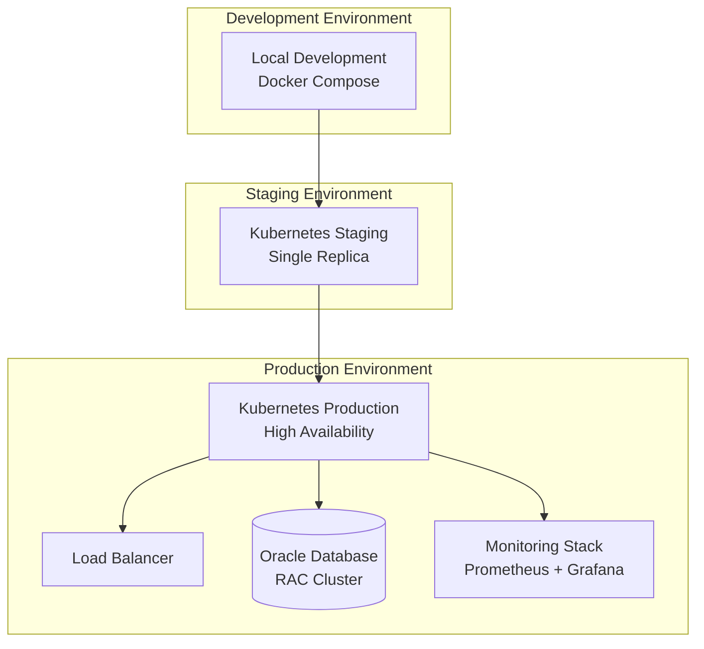

# Deployment Guide
## Table of Contents

- [Deployment Guide](#deployment-guide)
  - [Deployment Overview](#deployment-overview)
    - [Supported Deployment Patterns](#supported-deployment-patterns)
  - [Prerequisites](#prerequisites)
    - [Infrastructure Requirements](#infrastructure-requirements)
      - [Minimum System Requirements](#minimum-system-requirements)
      - [Production Requirements](#production-requirements)
    - [External Dependencies](#external-dependencies)
      - [Oracle WMS System](#oracle-wms-system)
      - [Oracle Target Database](#oracle-target-database)
    - [Software Dependencies](#software-dependencies)
      - [Container Runtime](#container-runtime)
- [Docker Engine 20.10+](#docker-engine-2010)
- [Docker Compose v2.0+](#docker-compose-v20)
      - [Kubernetes (Production)](#kubernetes-production)
- [kubectl client](#kubectl-client)
- [Helm package manager](#helm-package-manager)
  - [Environment Configuration](#environment-configuration)
    - [Environment Variable Templates](#environment-variable-templates)
      - [Development Environment (.env.dev)](#development-environment-envdev)
- [FLEXT Framework Configuration](#flext-framework-configuration)
- [Oracle WMS Configuration (Development)](#oracle-wms-configuration-development)
- [Oracle Target Database (Development)](#oracle-target-database-development)
- [Pipeline Configuration (Development)](#pipeline-configuration-development)
      - [Production Environment (Kubernetes Secrets)](#production-environment-kubernetes-secrets)
    - [Configuration Management](#configuration-management)
      - [ConfigMap for Non-Secret Configuration](#configmap-for-non-secret-configuration)
  - [Docker Deployment](#docker-deployment)
    - [Development Docker Compose](#development-docker-compose)
- [docker-compose.dev.yml](#docker-composedevyml)
    - [Production Dockerfile](#production-dockerfile)
- [Dockerfile](#dockerfile)
- [System dependencies](#system-dependencies)
- [Install Poetry](#install-poetry)
- [Copy dependency files](#copy-dependency-files)
- [Development stage](#development-stage)
- [Production stage](#production-stage)
- [Install only production dependencies](#install-only-production-dependencies)
- [Create non-root user](#create-non-root-user)
- [Copy application code](#copy-application-code)
- [Health check](#health-check)
- [Default command](#default-command)
    - [Docker Build and Run](#docker-build-and-run)
- [Build development image](#build-development-image)
- [Build production image](#build-production-image)
- [Run development environment](#run-development-environment)
- [Run production container](#run-production-container)
  - [Kubernetes Deployment](#kubernetes-deployment)
    - [Namespace Setup](#namespace-setup)
- [namespace.yaml](#namespaceyaml)
    - [Deployment Configuration](#deployment-configuration)
- [deployment.yaml](#deploymentyaml)
    - [Service and Ingress](#service-and-ingress)
- [service.yaml](#serviceyaml)
- [ingress.yaml](#ingressyaml)
    - [CronJob for Scheduled Pipelines](#cronjob-for-scheduled-pipelines)
- [cronjob.yaml](#cronjobyaml)
  - [Monitoring and Observability](#monitoring-and-observability)
    - [Prometheus Monitoring](#prometheus-monitoring)
- [servicemonitor.yaml](#servicemonitoryaml)
    - [Grafana Dashboard](#grafana-dashboard)
    - [Alerting Rules](#alerting-rules)
- [alerts.yaml](#alertsyaml)
  - [Security Configuration](#security-configuration)
    - [RBAC Configuration](#rbac-configuration)
- [rbac.yaml](#rbacyaml)
    - [Network Policies](#network-policies)
- [networkpolicy.yaml](#networkpolicyyaml)
  - [Backup and Disaster Recovery](#backup-and-disaster-recovery)
    - [Data Backup Strategy](#data-backup-strategy)
- [backup-meltano-data.sh](#backup-meltano-datash)
- [Backup Meltano state and configuration](#backup-meltano-state-and-configuration)
- [Copy backup to persistent storage](#copy-backup-to-persistent-storage)
- [Backup secrets and configurations](#backup-secrets-and-configurations)
    - [Disaster Recovery Procedure](#disaster-recovery-procedure)
- [disaster-recovery.sh](#disaster-recoverysh)
- [1. Restore namespace](#1-restore-namespace)
- [2. Restore secrets and configmaps](#2-restore-secrets-and-configmaps)
- [3. Restore deployment](#3-restore-deployment)
- [4. Restore Meltano data](#4-restore-meltano-data)
- [5. Verify deployment](#5-verify-deployment)
  - [Deployment Checklist](#deployment-checklist)
    - [Pre-Deployment Validation](#pre-deployment-validation)
    - [Deployment Steps](#deployment-steps)
    - [Post-Deployment Validation](#post-deployment-validation)


**GrupoNOS Meltano Native Production Deployment** - Enterprise deployment strategies,
     infrastructure requirements, and operational procedures.

## Deployment Overview

GrupoNOS Meltano Native supports multiple deployment patterns designed for enterprise environments with high availability,
    
     scalability, and security requirements.

### Supported Deployment Patterns



---

## Prerequisites

### Infrastructure Requirements

#### Minimum System Requirements

- **CPU**: 4 cores (8 recommended for production)
- **Memory**: 8GB RAM (16GB recommended for production)
- **Storage**: 100GB available disk space
- **Network**: Outbound HTTPS access to Oracle WMS APIs

#### Production Requirements

- **CPU**: 8+ cores with high clock speed
- **Memory**: 32GB+ RAM for large dataset processing
- **Storage**: 500GB+ SSD storage with backup capabilities
- **Network**: Dedicated network connection to Oracle systems

### External Dependencies

#### Oracle WMS System

- **Oracle WMS REST API**: v2.0+ with authenticated access
- **Network Access**: HTTPS connectivity to WMS endpoints
- **Credentials**: Service account with read permissions
- **Rate Limits**: Understanding of API rate limiting policies

#### Oracle Target Database

- **Oracle Database**: 19c+ (21c recommended)
- **Network Access**: Direct connection via TCP or TCPS
- **Credentials**: ETL service account with DDL/DML permissions
- **Schema**: Dedicated schema for ETL operations
- **Tablespaces**: Sufficient space for data volume

### Software Dependencies

#### Container Runtime

```bash
# Docker Engine 20.10+
curl -fsSL https://get.docker.com -o get-docker.sh
sudo sh get-docker.sh

# Docker Compose v2.0+
sudo apt-get install docker-compose-plugin
```

#### Kubernetes (Production)

```bash
# kubectl client
curl -LO "https://dl.k8s.io/release/$(curl -L -s https://dl.k8s.io/release/stable.txt)/bin/linux/amd64/kubectl"
sudo install -o root -g root -m 0755 kubectl /usr/local/bin/kubectl

# Helm package manager
curl https://raw.githubusercontent.com/helm/helm/main/scripts/get-helm-3 | bash
```

---

## Environment Configuration

### Environment Variable Templates

#### Development Environment (.env.dev)

```bash
# FLEXT Framework Configuration
FLEXT_ENVIRONMENT=development
FLEXT_LOG_LEVEL=DEBUG
FLEXT_ENABLE_METRICS=true
FLEXT_ENABLE_TRACING=true

# Oracle WMS Configuration (Development)
TAP_ORACLE_WMS_BASE_URL=https://invalid.wms.ocs.oraclecloud.com/api/v1
TAP_ORACLE_WMS_USERNAME=gruponos_etl_dev
TAP_ORACLE_WMS_PASSWORD=dev_password
TAP_ORACLE_WMS_COMPANY_CODE=GNOS_DEV
TAP_ORACLE_WMS_FACILITY_CODE=DC_DEV
TAP_ORACLE_WMS_TIMEOUT=300
TAP_ORACLE_WMS_BATCH_SIZE=1000

# Oracle Target Database (Development)
FLEXT_TARGET_ORACLE_HOST=oracle.invalid-company.com
FLEXT_TARGET_ORACLE_PORT=1521
FLEXT_TARGET_ORACLE_SERVICE_NAME=GNOSDEV
FLEXT_TARGET_ORACLE_USERNAME=gruponos_etl_dev
FLEXT_TARGET_ORACLE_PASSWORD=dev_db_password
FLEXT_TARGET_ORACLE_PROTOCOL=tcp
FLEXT_TARGET_ORACLE_SCHEMA=WMS_DEV

# Pipeline Configuration (Development)
GRUPONOS_ENABLE_VALIDATION=true
GRUPONOS_VALIDATION_THRESHOLD=0.90
GRUPONOS_BATCH_SIZE=1000
GRUPONOS_MAX_WORKERS=2
```

#### Production Environment (Kubernetes Secrets)

```yaml
apiVersion: v1
kind: Secret
metadata:
  name: gruponos-meltano-secrets
  namespace: gruponos-etl
type: Opaque
stringData:
  # Oracle WMS Credentials
  TAP_ORACLE_WMS_USERNAME: "gruponos_etl_prod"
  TAP_ORACLE_WMS_PASSWORD: "secure_wms_password"

  # Oracle Database Credentials
  FLEXT_TARGET_ORACLE_USERNAME: "gruponos_etl_prod"
  FLEXT_TARGET_ORACLE_PASSWORD: "secure_db_password"

  # Additional secrets
  FLEXT_ENCRYPTION_KEY: "base64_encoded_encryption_key"
  MONITORING_API_KEY: "monitoring_system_api_key"
```

### Configuration Management

#### ConfigMap for Non-Secret Configuration

```yaml
apiVersion: v1
kind: ConfigMap
metadata:
  name: gruponos-meltano-config
  namespace: gruponos-etl
data:
  # FLEXT Framework Configuration
  FLEXT_ENVIRONMENT: "production"
  FLEXT_LOG_LEVEL: "INFO"
  FLEXT_ENABLE_METRICS: "true"
  FLEXT_ENABLE_TRACING: "true"

  # Oracle WMS Configuration
  TAP_ORACLE_WMS_BASE_URL: "https://wms-prod.invalid-company.com/api/v1"
  TAP_ORACLE_WMS_COMPANY_CODE: "GNOS"
  TAP_ORACLE_WMS_FACILITY_CODE: "DC01"
  TAP_ORACLE_WMS_TIMEOUT: "600"
  TAP_ORACLE_WMS_BATCH_SIZE: "10000"

  # Oracle Target Database Configuration
  FLEXT_TARGET_ORACLE_HOST: "oracle.invalid-company.com"
  FLEXT_TARGET_ORACLE_PORT: "1522"
  FLEXT_TARGET_ORACLE_SERVICE_NAME: "GNOSPROD"
  FLEXT_TARGET_ORACLE_PROTOCOL: "tcps"
  FLEXT_TARGET_ORACLE_SCHEMA: "WMS_PROD"

  # Pipeline Configuration
  GRUPONOS_ENABLE_VALIDATION: "true"
  GRUPONOS_VALIDATION_THRESHOLD: "0.95"
  GRUPONOS_BATCH_SIZE: "10000"
  GRUPONOS_MAX_WORKERS: "4"
```

---

## Docker Deployment

### Development Docker Compose

```yaml
# docker-compose.dev.yml
version: "3.8"

services:
  gruponos-meltano:
    build:
      context: .
      dockerfile: Dockerfile
      target: development
    ports:
      - "8080:8080"
    environment:
      - FLEXT_ENVIRONMENT=development
    env_file:
      - .env.dev
    volumes:
      - .:/app
      - meltano_data:/app/.meltano
    depends_on:
      - postgres
      - redis

  postgres:
    image: postgres:15-alpine
    environment:
      POSTGRES_DB: gruponos_meltano
      POSTGRES_USER: meltano
      POSTGRES_PASSWORD: meltano_dev_password
    ports:
      - "5432:5432"
    volumes:
      - postgres_data:/var/lib/postgresql/data

  redis:
    image: redis:7-alpine
    ports:
      - "6379:6379"
    volumes:
      - redis_data:/data

volumes:
  postgres_data:
  redis_data:
  meltano_data:
```

### Production Dockerfile

```dockerfile
# Dockerfile
FROM python:3.13-slim as base

# System dependencies
RUN apt-get update && apt-get install -y \
    curl \
    git \
    build-essential \
    && rm -rf /var/lib/apt/lists/*

# Install Poetry
RUN pip install poetry==1.8.0
RUN poetry config virtualenvs.create false

WORKDIR /app

# Copy dependency files
COPY pyproject.toml poetry.lock ./

# Development stage
FROM base as development
RUN poetry install --with dev,test
COPY . .
CMD ["make", "dev-server"]

# Production stage
FROM base as production

# Install only production dependencies
RUN poetry install --only main --no-dev

# Create non-root user
RUN useradd --create-home --shell /bin/bash gruponos
RUN chown -R gruponos:gruponos /app
USER gruponos

# Copy application code
COPY --chown=gruponos:gruponos . .

# Health check
HEALTHCHECK --interval=30s --timeout=10s --start-period=60s --retries=3 \
    CMD python -c "from gruponos_meltano_native.cli import cli; import sys; sys.exit(0)"

# Default command
CMD ["poetry", "run", "python", "-m", "gruponos_meltano_native.cli", "run", "--job", "full-sync-job"]
```

### Docker Build and Run

```bash
# Build development image
docker build --target development -t gruponos-meltano:dev .

# Build production image
docker build --target production -t gruponos-meltano:prod .

# Run development environment
docker-compose -f docker-compose.dev.yml up -d

# Run production container
docker run -d \
  --name gruponos-meltano-prod \
  --env-file .env.prod \
  -p 8080:8080 \
  gruponos-meltano:prod
```

---

## Kubernetes Deployment

### Namespace Setup

```yaml
# namespace.yaml
apiVersion: v1
kind: Namespace
metadata:
  name: gruponos-etl
  labels:
    name: gruponos-etl
    environment: production
```

### Deployment Configuration

```yaml
# deployment.yaml
apiVersion: apps/v1
kind: Deployment
metadata:
  name: gruponos-meltano
  namespace: gruponos-etl
  labels:
    app: gruponos-meltano
    version: v0.9.9
spec:
  replicas: 3
  strategy:
    type: RollingUpdate
    rollingUpdate:
      maxUnavailable: 1
      maxSurge: 1
  selector:
    matchLabels:
      app: gruponos-meltano
  template:
    metadata:
      labels:
        app: gruponos-meltano
        version: v0.9.9
    spec:
      serviceAccountName: gruponos-meltano
      securityContext:
        runAsNonRoot: true
        runAsUser: 1000
        fsGroup: 1000
      containers:
        - name: gruponos-meltano
          image: gruponos-meltano:v0.9.9
          imagePullPolicy: Always
          ports:
            - containerPort: 8080
              name: http
          env:
            - name: FLEXT_ENVIRONMENT
              value: "production"
          envFrom:
            - configMapRef:
                name: gruponos-meltano-config
            - secretRef:
                name: gruponos-meltano-secrets
          resources:
            requests:
              memory: "2Gi"
              cpu: "1000m"
            limits:
              memory: "8Gi"
              cpu: "4000m"
          livenessProbe:
            httpGet:
              path: /health
              port: 8080
            initialDelaySeconds: 60
            periodSeconds: 30
            timeoutSeconds: 10
          readinessProbe:
            httpGet:
              path: /ready
              port: 8080
            initialDelaySeconds: 30
            periodSeconds: 10
            timeoutSeconds: 5
          volumeMounts:
            - name: meltano-data
              mountPath: /app/.meltano
            - name: config-volume
              mountPath: /app/config
              readOnly: true
      volumes:
        - name: meltano-data
          persistentVolumeClaim:
            claimName: meltano-data-pvc
        - name: config-volume
          configMap:
            name: gruponos-meltano-config
```

### Service and Ingress

```yaml
# service.yaml
apiVersion: v1
kind: Service
metadata:
  name: gruponos-meltano
  namespace: gruponos-etl
  labels:
    app: gruponos-meltano
spec:
  type: ClusterIP
  ports:
    - port: 80
      targetPort: 8080
      name: http
  selector:
    app: gruponos-meltano

---
# ingress.yaml
apiVersion: networking.k8s.io/v1
kind: Ingress
metadata:
  name: gruponos-meltano
  namespace: gruponos-etl
  annotations:
    kubernetes.io/ingress.class: nginx
    cert-manager.io/cluster-issuer: letsencrypt-prod
    nginx.ingress.kubernetes.io/ssl-redirect: "true"
spec:
  tls:
    - hosts:
        - etl.invalid-company.com
      secretName: gruponos-meltano-tls
  rules:
    - host: etl.invalid-company.com
      http:
        paths:
          - path: /
            pathType: Prefix
            backend:
              service:
                name: gruponos-meltano
                port:
                  number: 80
```

### CronJob for Scheduled Pipelines

```yaml
# cronjob.yaml
apiVersion: batch/v1
kind: CronJob
metadata:
  name: gruponos-full-sync
  namespace: gruponos-etl
spec:
  schedule: "0 2 * * 0" # Weekly at 2 AM Sunday
  timeZone: "America/Sao_Paulo"
  jobTemplate:
    spec:
      template:
        spec:
          serviceAccountName: gruponos-meltano
          restartPolicy: OnFailure
          containers:
            - name: gruponos-full-sync
              image: gruponos-meltano:v0.9.9
              command:
                - "poetry"
                - "run"
                - "python"
                - "-m"
                - "gruponos_meltano_native.cli"
                - "run"
                - "--job"
                - "full-sync-job"
              envFrom:
                - configMapRef:
                    name: gruponos-meltano-config
                - secretRef:
                    name: gruponos-meltano-secrets
              resources:
                requests:
                  memory: "4Gi"
                  cpu: "2000m"
                limits:
                  memory: "16Gi"
                  cpu: "8000m"

---
apiVersion: batch/v1
kind: CronJob
metadata:
  name: gruponos-incremental-sync
  namespace: gruponos-etl
spec:
  schedule: "0 */2 * * *" # Every 2 hours
  timeZone: "America/Sao_Paulo"
  jobTemplate:
    spec:
      template:
        spec:
          serviceAccountName: gruponos-meltano
          restartPolicy: OnFailure
          containers:
            - name: gruponos-incremental-sync
              image: gruponos-meltano:v0.9.9
              command:
                - "poetry"
                - "run"
                - "python"
                - "-m"
                - "gruponos_meltano_native.cli"
                - "run"
                - "--job"
                - "incremental-sync-job"
              envFrom:
                - configMapRef:
                    name: gruponos-meltano-config
                - secretRef:
                    name: gruponos-meltano-secrets
              resources:
                requests:
                  memory: "2Gi"
                  cpu: "1000m"
                limits:
                  memory: "8Gi"
                  cpu: "4000m"
```

---

## Monitoring and Observability

### Prometheus Monitoring

```yaml
# servicemonitor.yaml
apiVersion: monitoring.coreos.com/v1
kind: ServiceMonitor
metadata:
  name: gruponos-meltano
  namespace: gruponos-etl
  labels:
    app: gruponos-meltano
spec:
  selector:
    matchLabels:
      app: gruponos-meltano
  endpoints:
    - port: http
      path: /metrics
      interval: 30s
      scrapeTimeout: 10s
```

### Grafana Dashboard

```json
{
  "dashboard": {
    "title": "GrupoNOS Meltano Native - Pipeline Monitoring",
    "panels": [
      {
        "title": "Pipeline Execution Rate",
        "targets": [
          {
            "expr": "rate(pipeline_executions_total[5m])",
            "legendFormat": "{{pipeline}} - {{status}}"
          }
        ]
      },
      {
        "title": "Pipeline Duration",
        "targets": [
          {
            "expr": "histogram_quantile(0.95, rate(pipeline_duration_seconds_bucket[5m]))",
            "legendFormat": "95th percentile"
          }
        ]
      },
      {
        "title": "Records Processed",
        "targets": [
          {
            "expr": "increase(pipeline_records_processed[1h])",
            "legendFormat": "{{pipeline}}"
          }
        ]
      },
      {
        "title": "Data Quality Score",
        "targets": [
          {
            "expr": "data_quality_score",
            "legendFormat": "{{entity}}"
          }
        ]
      }
    ]
  }
}
```

### Alerting Rules

```yaml
# alerts.yaml
apiVersion: monitoring.coreos.com/v1
kind: PrometheusRule
metadata:
  name: gruponos-meltano-alerts
  namespace: gruponos-etl
spec:
  groups:
    - name: gruponos-meltano
      rules:
        - alert: PipelineExecutionFailure
          expr: increase(pipeline_executions_total{status="failure"}[5m]) > 0
          for: 0m
          labels:
            severity: critical
          annotations:
            summary: "GrupoNOS pipeline execution failed"
            description: "Pipeline {{ $labels.pipeline }} failed for company {{ $labels.company }}"

        - alert: PipelineDurationHigh
          expr: histogram_quantile(0.95, rate(pipeline_duration_seconds_bucket[5m])) > 3600
          for: 10m
          labels:
            severity: warning
          annotations:
            summary: "GrupoNOS pipeline duration is high"
            description: "Pipeline execution time is above 1 hour"

        - alert: DataQualityLow
          expr: data_quality_score < 0.90
          for: 5m
          labels:
            severity: warning
          annotations:
            summary: "GrupoNOS data quality score is low"
            description: "Data quality score for {{ $labels.entity }} is {{ $value }}"
```

---

## Security Configuration

### RBAC Configuration

```yaml
# rbac.yaml
apiVersion: v1
kind: ServiceAccount
metadata:
  name: gruponos-meltano
  namespace: gruponos-etl

---
apiVersion: rbac.authorization.k8s.io/v1
kind: Role
metadata:
  namespace: gruponos-etl
  name: gruponos-meltano
rules:
  - apiGroups: [""]
    resources: ["configmaps", "secrets"]
    verbs: ["get", "list"]
  - apiGroups: ["batch"]
    resources: ["jobs", "cronjobs"]
    verbs: ["get", "list", "create"]

---
apiVersion: rbac.authorization.k8s.io/v1
kind: RoleBinding
metadata:
  name: gruponos-meltano
  namespace: gruponos-etl
subjects:
  - kind: ServiceAccount
    name: gruponos-meltano
    namespace: gruponos-etl
roleRef:
  kind: Role
  name: gruponos-meltano
  apiGroup: rbac.authorization.k8s.io
```

### Network Policies

```yaml
# networkpolicy.yaml
apiVersion: networking.k8s.io/v1
kind: NetworkPolicy
metadata:
  name: gruponos-meltano
  namespace: gruponos-etl
spec:
  podSelector:
    matchLabels:
      app: gruponos-meltano
  policyTypes:
    - Ingress
    - Egress
  ingress:
    - from:
        - namespaceSelector:
            matchLabels:
              name: ingress-nginx
      ports:
        - protocol: TCP
          port: 8080
  egress:
    - to: []
      ports:
        - protocol: TCP
          port: 443 # HTTPS to Oracle WMS
        - protocol: TCP
          port: 1521 # Oracle Database
        - protocol: TCP
          port: 1522 # Oracle Database SSL
        - protocol: TCP
          port: 53 # DNS
        - protocol: UDP
          port: 53 # DNS
```

---

## Backup and Disaster Recovery

### Data Backup Strategy

```bash
#!/bin/bash
# backup-meltano-data.sh

# Backup Meltano state and configuration
kubectl exec -n gruponos-etl deployment/gruponos-meltano -- \
  tar czf /tmp/meltano-backup-$(date +%Y%m%d).tar.gz \
  .meltano/

# Copy backup to persistent storage
kubectl cp gruponos-etl/gruponos-meltano-pod:/tmp/meltano-backup-$(date +%Y%m%d).tar.gz \
  ./backups/meltano-backup-$(date +%Y%m%d).tar.gz

# Backup secrets and configurations
kubectl get secrets -n gruponos-etl -o yaml > backups/secrets-$(date +%Y%m%d).yaml
kubectl get configmaps -n gruponos-etl -o yaml > backups/configmaps-$(date +%Y%m%d).yaml
```

### Disaster Recovery Procedure

```bash
#!/bin/bash
# disaster-recovery.sh

# 1. Restore namespace
kubectl apply -f namespace.yaml

# 2. Restore secrets and configmaps
kubectl apply -f backups/secrets-latest.yaml
kubectl apply -f backups/configmaps-latest.yaml

# 3. Restore deployment
kubectl apply -f deployment.yaml
kubectl apply -f service.yaml
kubectl apply -f cronjob.yaml

# 4. Restore Meltano data
kubectl exec -n gruponos-etl deployment/gruponos-meltano -- \
  tar xzf /tmp/meltano-backup-latest.tar.gz

# 5. Verify deployment
kubectl get pods -n gruponos-etl
kubectl logs -n gruponos-etl deployment/gruponos-meltano
```

---

## Deployment Checklist

### Pre-Deployment Validation

- [ ] **Infrastructure Ready**: Kubernetes cluster accessible and configured
- [ ] **Dependencies Available**: Oracle WMS API and database accessible
- [ ] **Secrets Configured**: All required secrets created in Kubernetes
- [ ] **Images Built**: Application Docker images built and pushed to registry
- [ ] **Monitoring Setup**: Prometheus and Grafana configured
- [ ] **Backup Strategy**: Backup procedures tested and validated

### Deployment Steps

1. **Create Namespace**: `kubectl apply -f namespace.yaml`
2. **Deploy Secrets**: `kubectl apply -f secrets.yaml`
3. **Deploy ConfigMaps**: `kubectl apply -f configmaps.yaml`
4. **Deploy RBAC**: `kubectl apply -f rbac.yaml`
5. **Deploy Application**: `kubectl apply -f deployment.yaml`
6. **Deploy Service**: `kubectl apply -f service.yaml`
7. **Deploy Ingress**: `kubectl apply -f ingress.yaml`
8. **Deploy CronJobs**: `kubectl apply -f cronjob.yaml`
9. **Deploy Monitoring**: `kubectl apply -f servicemonitor.yaml`

### Post-Deployment Validation

- [ ] **Pods Running**: All pods in Running state
- [ ] **Health Checks**: Liveness and readiness probes passing
- [ ] **Oracle Connectivity**: WMS API and database connections successful
- [ ] **Pipeline Execution**: Test pipeline runs successfully
- [ ] **Monitoring Active**: Metrics being collected and displayed
- [ ] **Alerting Functional**: Test alerts trigger correctly
- [ ] **Scheduled Jobs**: CronJobs execute on schedule

---

**Next**: [Monitoring](monitoring.md) | [Troubleshooting](troubleshooting.md) | [Performance Tuning](performance.md)
